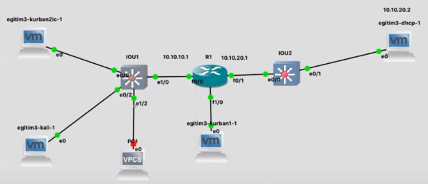
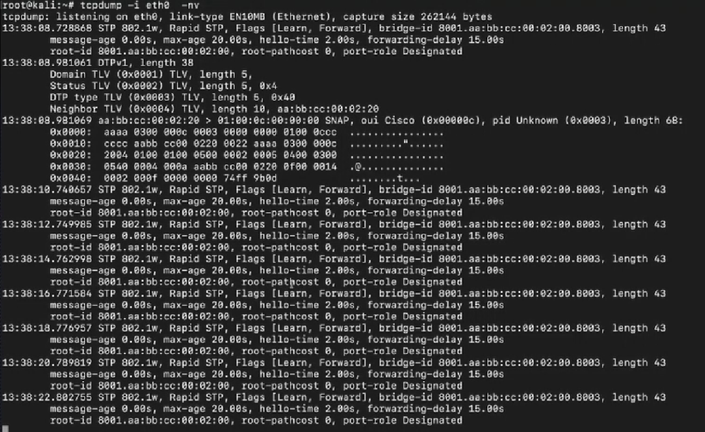
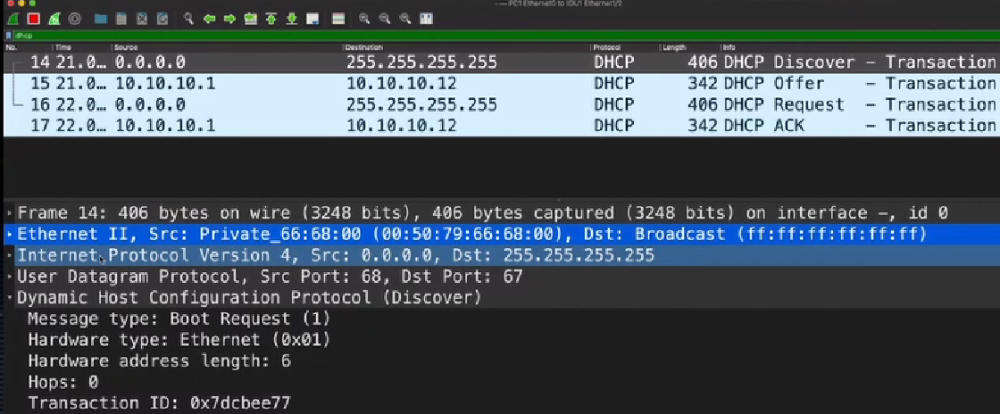
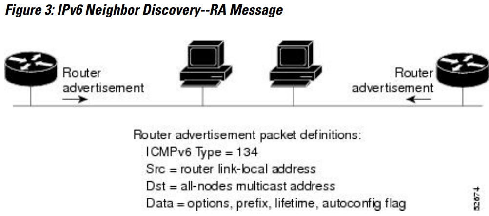
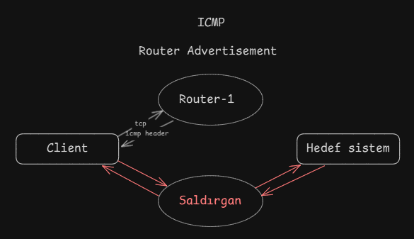

# **Network Hacker 0x03 - VLAN, ICMP ve MITM Saldırıları /w Barkın Kılıç**

Eğitim serisinin [3. videosunu](https://www.twitch.tv/videos/651833521) yazılı hale getirmeye çalışacağım. Keyifli okumalar dilerim.  

## **0x00 : Giriş**

Önceki iki eğitimde, bir sistemin nasıl konfigüre edileceğini ve ağa dahil olduğunda kendini nasıl gizleyebileceğini öğrendik. Bağlandığımız ağda hangi protokollerin konuşulduğu, hangi sistemlerin dahil olduğu ve bu protokolleri manipüle ederek nasıl müdahale edilebileceği üzerine konuştuk.


## **0x01 : Topoloji**



Bu yapı, önceki eğitimlerde kullanılan yapıdan farklı. İki ayrı subnet örneklenmiştir:  
**Soldaki Subnet:** Bir switch'e bağlı sistemler.  
**Sağdaki Subnet:** Ayrı bir switch'e bağlı sistemler.  
**Router:** Ortada yer alarak subnetler arası bağlantıyı sağlar. Router'a doğrudan bağlı bir sistem bulunmaktadır (ayrı bir subnet olarak düşünebilirsiniz).

> **Not:** Soldaki **Kali Linux** makinesi, önceki eğitimlerde olduğu gibi IPv4 ve IPv6 kapatılarak ağa dahil edilmiştir. İlk adım, bu ağdaki trafiği dinlemektir.

---

## **0x02 : TCPDUMP ile Trafik Dinleme**

Ağ trafiğini görüntülemek için `tcpdump` kullanıyoruz:

```bash
tcpdump -i eth0 -nv
```

Subnet içerisindeki konuşmalar görüntülenir. Örneğin, DHCP sunucusunun kim olduğunu ve nasıl iletişim kurulacağını öğrenebiliriz.



Ağa bir DHCP Discover paketi gönderip yanıtını analiz edeceğiz.  

### **DORA Süreci Nedir?**

Bir sistemin IP konfigürasyonu almak için kullandığı adımlar:  
1. **Discover:** Sistem, broadcast yaparak DHCP sunucusunu arar.  
2. **Offer:** DHCP sunucusu, uygun IP adreslerini içeren bir teklif gönderir.  
3. **Request:** Sistem, sunucudan teklif edilen IP adresini talep eder.  
4. **ACK:** DHCP sunucusu, talebi onaylar ve yapılandırmayı tamamlar.

## **0x03 : Wireshark ile Analiz**



- **Ethernet Katmanı:** MAC adresleri.  
- **IP Katmanı:** Kaynak ve hedef IP'ler. IP konfigürasyonu olmadığı için kaynak IP `0.0.0.0` ve hedef IP `255.255.255.255` olarak ayarlanmıştır. (broadcast)
- **UDP Katmanı:** Kaynak port (68) ve hedef port (67).  Hızlı ve oturum kontrolü olmayan bir protokol.
- **Uygulama Katmanı:** DHCP  

> **Not:** Windows sistemi, bu işlem sonunda DHCP kayıtlarına eklenir ve bir IP adresi rezerve eder.


## **0x04 : Manuel DHCP Discover - Kan çıktı**

Bu işlemi manuel olarak gerçekleştirelim ve kendimizi DHCP sunucusu olarak tanıtalım. Aşağıdaki Python betiği kullanılmıştır:

```python
from scapy.all import *

ether_header = Ether(src="00:50:79:66:68:00", dst="ff:ff:ff:ff:ff:ff")
ip_header = IP(src="0.0.0.0", dst="255.255.255.255")
udp_header = UDP(sport=68, dport=67)
bootp_header = BOOTP(chaddr=RandString(12, "0123456789abcdef"))

request_option_1 = 1    # Subnet Mask
request_option_2 = 6    # DNS
request_option_3 = 15   # Domain Name
request_option_4 = 44   # NetBIOS (TCP/IP) Name Servers
request_option_5 = 3    # Routers
request_option_6 = 33   # Static Routes
request_option_7 = 150  # TFTP Server address
request_option_8 = 43   # Vendor Specific Information
request_option_9 = 252  # Proxy / wpad

bytes_request_options = struct.pack(b"9B", request_option_1, request_option_2, request_option_3, request_option_4, request_option_5, request_option_6, request_option_7, request_option_8, request_option_9)

dhcp_header = DHCP(options=[(b'message-type', b'discover'), (b'param_req_list', bytes_request_options), b'end'])

packet = ether_header / ip_header / udp_header / bootp_header / dhcp_header

sendp(packet, iface = "eth0")

```
**`Ether`:** Ethernet başlığında kaynak MAC adresi rastgele ayarlandı, hedef adres `ff:ff:ff:ff:ff:ff` (broadcast).  
**`IP`:** Kaynak IP `0.0.0.0`, hedef IP `255.255.255.255` (broadcast).  
**`UDP`:** DHCP için sabit portlar (68 ve 67).  
**`BOOTP`:** Rastgele bir istemci MAC adresi oluşturuldu.  
**`DHCP`:** İstek listesiyle birlikte bir Discover mesajı gönderildi.  

Böylece bir paketi ağda yayınlayarak, DHCP sunucusu gibi davranabildik.

Kurbanın yaptığı DHCP Discover yayını, saldırgan tarafından dinlenebilir çünkü broadcast yapılır.  Saldırgan aynı paketi kendisi göndererek switch üzerinde bir rezervasyon oluşturabilir. Bu durum, switch'in kafasını karıştırarak hem kurbanın hem de saldırganın paket almasını sağlayabilir. Bu işlem ARP veya klasik MITM kullanmadan, DHCP sürecini manipüle ederek yapılır.

### **0x05 : Router Advertisement**

**ARP Güvenliği ve MITM Engelleri:**
- **ARP Inspection:** Switch üzerindeki portlar **trusted** veya **untrusted** olarak işaretlenebilir.  
  - **Trusted Portlar:** Router ve kurban arasındaki portlar.  
  - **Untrusted Portlar:** Örneğin, saldırganın bağlı olduğu port.  
- **DHCP Snooping:** Sahte DHCP sunucularını engelleyen bir güvenlik önlemi.  

Bizim topolojimizde teorik olarak switchte port kapatma gibi bir özellik yok bunun yerine paketlerin gelmesi engelleniyor ancak pratikte swithin port kapattığı örneklere de denk gelebilirsiniz Port kapanınca da haliyle networkten iletişiminiz kesiliyor. 

Bütün bunlara rağmen ICMP Router Advertisement protokolü kullanılarak MITM gerçekleştirilebiliyor



### **ICMP Router Advertisement:**

**Nasıl Çalışır ve Manipüle edilir?**

Bir router, ICMP kullanarak ağdaki istemcilere daha uygun bir router üzerinden yönlendirme yapmasını söyler.  

Saldırgan, ICMP headerına payload olarak gönderdiğimiz TCP’yi yerleştirir. ICMP'nin type ve code değerlerini kullanarak **router advertisement** özelliğini seçer ve hedef sisteme, "Bu göndermeye çalıştığın paketi şu IP adresindeki router üzerinden iletebilirsin" der. Bu noktadan sonra, sistem ilk göndermeye çalıştığı TCP paketini alır ve bu kez **router advertisement** üzerinden belirtilen IP adresine sahip **router-2** üzerinden göndermeye çalışır. Trafik bu şekilde yönlendirilir.

Teoride, saldırganın hedef sistemin ilk aşamada göndermeye çalıştığı TCP paketini görmesi, bu paketin hedefe ulaşmasını engellemesi ve ardından bir ICMP paketi içerisine yerleştirip göndermesi gerekir. Bu sayede trafik, saldırganın kontrol ettiği bir yol üzerinden yönlendirilmiş olur. 

Pratikte ise durum farklıdır. Saldırgan, istemciden T0 anında gönderilmiş gibi görünen bir paket oluşturur. Bu pakette bir IP başlığı, bir ICMP başlığı ve onun altında bir TCP başlığı bulunur. TCP başlığının altında da örneğin HTTP gibi bir payload yer alır (payloadun ne olduğu önemli değil). 

Bu saldırıda, genellikle **ARP table poisoning** gibi tekniklere başvurulmaz. Çünkü bu tür saldırılar, ağdaki switch'lerin üzerindeki ARP inspection gibi mekanizmalarla engellenebilir. Bunun yerine saldırgan, istemcinin ilk TCP paketini yakalar ve bu paketin hedefe ulaşmasına izin vermez. Ardından istemciye bir ICMP paketi gönderir ve şöyle der: 

"Senin ağda daha iyi iletişim kurabileceğin bir başka router var. Bu router şu IP adresinde, bu router üzerinden iletişim kur." 

Bu mesajı aldıktan sonra, TCP katmanındaki tüm trafik, saldırganın belirlediği yeni IP adresine yönlenir. Bu şekilde Man-in-the-Middle (MITM) saldırısı gerçekleştirilmiş olur.



### **0x06 : MITM (Man-in-the-Middle)**


Saldırgan, Kurban-1 makinesine doğrudan saldıramaz çünkü aynı ağda oldukları için aralarındaki iletişim bir router gerektirmez. Ancak hedefimiz Kurban-1 olduğunda ve bu makine Kurban-2 ile iletişim halindeyse, saldırgan bu konuşmaların arasına girebilir. Bu durumda, Kurban-1'e ICMP redirection paketi göndererek trafik yönlendirmesi yapılabilir. Çünkü Kurban-1 ve Kurban-2, bir router'ın arkasındaki sistemlerdir. Saldırgan, ICMP advertisement paketiyle müdahale ederek trafiğin kendi üzerinden yönlendirilmesini sağlayabilir. Bu yöntemle, switch üzerindeki katman 2 güvenlik önlemleri de aşılmış olur.

Saldırgan, ICMP tablosuna kendi IP adresini ekler ve bu sayede tüm trafiğin kendi üzerinden geçmesini sağlar. Böylece **Man-in-the-Middle (MITM)** saldırısı başarılı bir şekilde gerçekleştirilir.

**Peki, neden saldırıyı bir sistemden diğerine yapıyoruz da doğrudan routera yönelmiyoruz?**

Bu noktada, devreye **BGP** (Border Gateway Protocol) ve **OSPF** (Open Shortest Path First) gibi protokoller giriyor. Routerlar kendi aralarında haberleşmek için bu protokolleri kullanır. Giden bir paketin, dönerken aynı routerlar üzerinden geçeceğine dair bir garanti yoktur. Routerlar arasındaki trafik yönlendirmesi, mevcut ağ durumuna göre değişiklik gösterebilir. Ancak, bu bakış açısıyla hareket ederek **BGP** veya **OSPF** protokollerini manipüle edebilirseniz, routerlara karşı da MITM saldırısı gerçekleştirebilirsiniz.