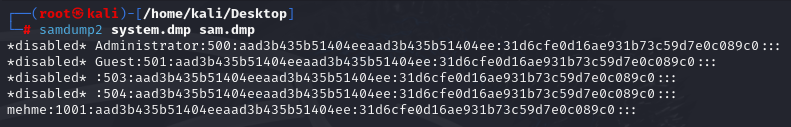
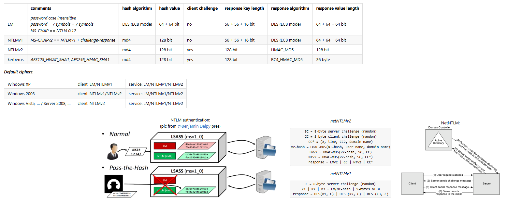
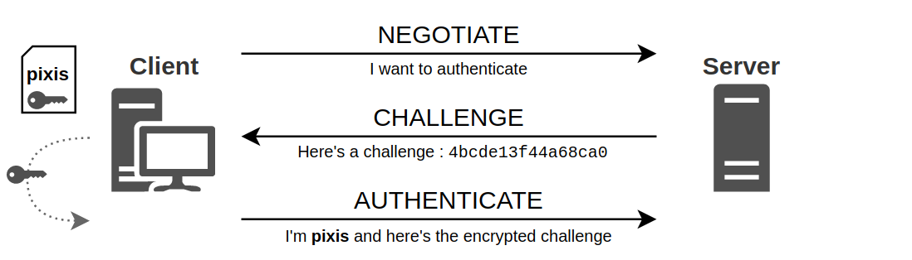
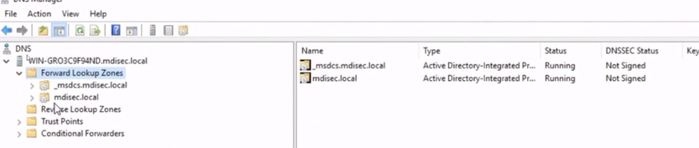
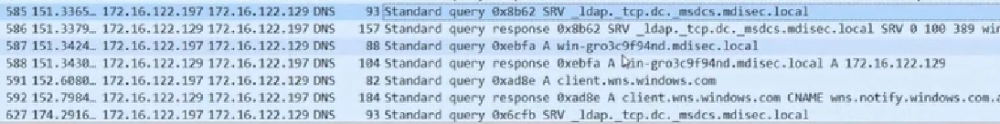
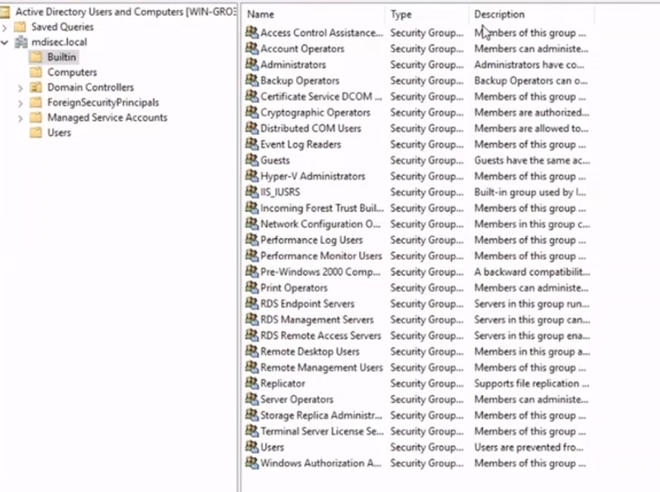
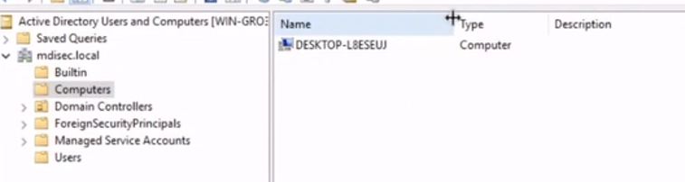
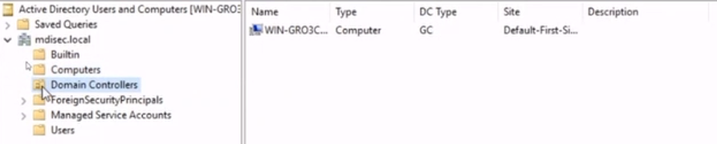
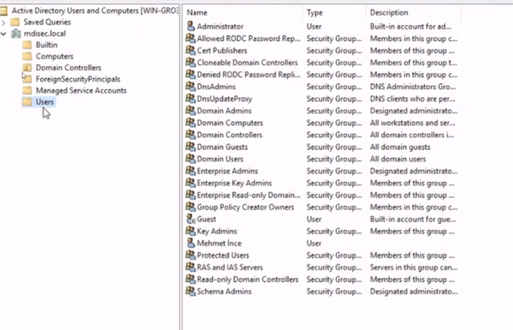

# **Network Hacker 0x05 - Windows ve Etki Alanı Dünyasına Giriş /w Barkın Kılıç**  

Eğitim serisinin [5. videosunu](https://www.twitch.tv/videos/665179900) yazılı hale getirmeye çalışacağım. Benim en çok keyif aldığım eğitimdi. Keyifli okumalar dilerim.  

## **0x00: Giriş**  
NTLM Relay konusunu geçtiğimiz eğitimde ele almıştık. Bu hafta Windows için authentication mekanizmalarının nasıl çalıştığını, Active Directory (AD) yapısını ve AD saldırılarını konuşacağız.  
Referans olarak [NTLM Relay](https://en.hackndo.com/ntlm-relay/) makalesinden faydalanılacak.  

## **0x01: Şifreler**  

Windows sistemlerinde kullanıcı bilgilerinin saklandığı dosya:  
`Windows/System32/config/SAM`  
Bu dosyada **LM** ve **NT** hashleri saklanır. Ancak bu dosyayı yalnızca sistem kullanıcıları okuyabilir. Normal bir kullanıcı dosyayı açmaya çalışırsa "Başka bir süreç tarafından kullanılıyor" hatası alır.  

### **SAM Dosyasına Erişim**  
Sistem çalışırken dosyaya erişmenin yolu var:  
1. Admin kullanıcı yetkisiyle registry kaydını alıp
   ```bash
   reg save HKLM\SAM C:\sam.dmp
   reg save HKLM\SYSTEM C:\system.dmp
   ```
2. Sonrasında bu iki dosyayı (SAM ve SYSTEM) bir araçla açabiliriz. Örneğin: [samdump2](https://www.kali.org/tools/samdump2/).  

     

   Kullanıcı adı : Kullanıcı kimlik değeri : LM Hashi : NT hashi :::
   - 32 Byte boyutunda nt hashi ve 32 byte boyutunda lm hashi görmekteyiz
   - Aslında bu hashlerin null olduğunu görürüz bunun sebebi de geriye dönük uyumluluk çerçevesinde lm hashlerini sisteme null olarak girilmesidir.

### **LM ve NT Hashleri**  



#### LM Hash  
- Harfler büyük-küçük farkı gözetilmez. (Case-insensitive)  
- Maksimum 14 karakter uzunluğundadır. Daha uzun parolalar kesilir.  
- Parolayı yedişer karakterlik iki parçaya böler ve güvensiz bir algoritma olan **DES** ile işler. Olasılık havuzu böylece yarıya düşmüş olur ve **Brute-force** saldırılarına daha açık hale gelir.  

#### NT Hash  
- LM'den daha güçlüdür.  
- Parolayı **MD4** algoritması ile işler.  
- Maksimum 32 karakter uzunluğunda ve büyük-küçük harf duyarlıdır.  

#### Python ile NT Hash Üretimi  
 
  

samdump2 ile elde ettiğimiz değerlere baktığımızda NT hashinin null değerin hashine tekabül ettiğini görebiliyoruz.

Burada da bir domain ortamında aynı parolayı kullanan insanların parola nt hashleri aynı olması gibi bir sorun oluşuyor.

## **0x02: NTLM Authentication**  

Windows, parolaların network üzerinden açık şekilde iletilmesini önlemek için NTLM protokolünü kullanır.  
### **NTLM'in Çalışma Mantığı**  
  
1. İstemci sunucuya bağlanır ve bir "el sıkışma" başlatılır.  
2. Sunucu, istemciye rastgele bir **challenge** değeri (16 byte) gönderir.  
3. İstemci:  
   - Challenge değerini kendi NT hashiyle birleştirir.  
   - Ortaya çıkan değeri sunucuya geri gönderir.  
4. Sunucu:  
   - Aynı işlemleri kendi NT hashiyle yapar.  
   - İki değeri karşılaştırır ve eşleşirse kullanıcıyı yetkilendirir.  

**NTLMv1:** 
  - Yukarıda anlatıldığı üzere basit bir yapı. Tuzlama gibi önlemleri yok, brute-forcea açık.  

**NTLMv2:** 
  - Daha güçlü. Hem istemci hem de sunucu kendi challenge değerlerini üretir. Değerler **HMAC-MD5** ile işlenir ve daha karmaşık bir çıktı oluşturur.  


## **0x03: Active Directory (AD)**  

Microsoft'un, sistemlerin ve kullanıcıların yönetimini kolaylaştırmak için geliştirdiği bir hizmettir.  
Kullanıcılar ve sistemler, bir ağaç yapısı gibi **LDAP** protokolüyle organize edilir.  
**Group Policy** ile merkezi yönetim sağlanır.  

### **AD'nin Çalışması için Önemli 2 Serivs**  
1. **LDAP:** Veri tabanı sorguları ve doğrulama işlemleri için.  
2. **DNS:** Sistemlerin birbirini bulması ve iletişim kurması için.  


AD'nin genel yapısı  
  

- **mdisec.local:** Domain içindeki kayıtların tutulduğu bölge.  
- **_msdcs.mdisec.local:** Servis kayıtlarının yer aldığı alt bölge.  

### **Domaine Makine Eklemek**  

Bir makineyi domaine eklemek için DNS servisi, domain controllerı göstermek zorunda.  

Domain eklerken süreci öğrenmek adına wiresharktan giden bu paketleri analiz edelim.
  

### **DNS Sorgusu ve Fully Qualified Domain Name (FQDN)**
**Fully Qualified Domain Name (FQDN)**: 
    Mutlak alan adı anlamına gelir. Sistemin ağaç hiyerarşisindeki tam konumunu belirten bir alan adıdır. Örneğin: `mdisec.local` bir alab adıdır ve DNS sorgularında sıklıkla son kısımda yer alır.

**SRV Kayıtları**:
    Belirli bir hizmetin hangi sunucuda çalıştığını gösterir. Örneğin, bir domain controllerın adresini bulmak için `_ldap._tcp.mdisec.local` gibi bir SRV sorgusu yapılabilir.

**Domain Controller'ın Tespiti sorguların temel 2 amacı vardır:**
  1. Hangi IP adresine sahip olduğunu öğrenmek.
  2. Hangi sunucu adıyla hizmet verdiğini öğrenmek.

Genelde DNS'e yapılan sorgular **SRV (Service) kayıtları** üzerinden gerçekleşir. Örneğin:
- `_ldap._tcp.mdisec.local` → LDAP hizmeti veren DC'yi bulmak için.
- `_kerberos._tcp.mdisec.local` → Kerberos hizmeti sunan DC'yi bulmak için.

Bu DNS sorguları, istemcilerin doğru domain controllera yönlendirilmesini sağlar. Örneğin:
- Bir istemci, domaine katılmak istediğinde, öncelikle DNS üzerinden SRV kayıtları sorgulanarak en yakın **Domain Controller** tespit edilir.

## **0x04: AD Yönetim Paneli**  

Active Directory, LDAP benzeri bir yapıdadır.  
- **Organizational Units (OU):** Birimler ve objeler buraya kaydedilir.  
- Her şey bir "obje" olarak yönetilir (kullanıcılar, makineler, gruplar).  

### **Örnek Dizinler**  
1. **Builtin:** Varsayılan güvenlik grupları.  
     
2. **Computers:** Domaine bağlı makineler.  
     
3. **Domain Controllers:** Domain controller olarak tanımlanmış makineler.  
     
4. **Users:** Kullanıcılar ve gruplar.  
     

`ForeignSecurityPrincipals` ve `ManagedSeviceAccount` ön tanımlı kurulan ancak içerisi boş gelen toplu gösterim objeleridir.

## **0x05: Enterprise Admini Anlamak Analoji**  

**Holding = Forest**:
  - Forest, AD'nin en üst seviyesi. Bütün domainlerin birleştiği yer ve tüm yapının küresel politikaları buradan kontrol edilebilir.
  
**Şirketler = Domainler**:
  - Forest içinde bulunan domainler, holding içindeki şirketler gibidir.
  - Her şirket kendi başına yönetilebilir (kendi Active Directory Domain Controllerlarıyla).
  - Bu domainler arasında **trust ilişkisi** kurulabilir, yani şirketler birbirleriyle bilgi paylaşımı yapabilir.

**Holding Yönetimi = Enterprise Admin**:
  - Holdingin en tepesindeki yönetici gibidir. Forest seviyesinde tüm domainler üzerinde tam yetkiye sahiptir.
  - Enterprise Admin, domain adminlerden daha yetkilidir çünkü tüm domainlerin politikalarını belirleyebilir ve yönetebilir.

**Şirket Yönetimi = Domain Admin**:
  - Her şirketin (domainin) kendi iç yönetiminden sorumlu olan yöneticilerdir.
  - Domain Admin, yalnızca kendi domainindeki kaynakları (kullanıcılar, gruplar, bilgisayarlar) yönetebilir.
  - Başka bir domainin kaynaklarına erişmesi için trust ilişkisi ve gerekli izinler gerekir.

**Trust İlişkisi**:
  - Şirketler (domainler) arasında bilgi paylaşımını sağlar.
  - **Çift Yönlü Trust**: Her iki taraf birbirinin kaynaklarına erişebilir.
  - **Tek Yönlü Trust**: Örneğin, sigorta şirketindeki bir personel, finans şirketinin kaynaklarına erişebilir ama finans personeli sigorta kaynaklarına erişemez.

## **0x06: Pentestlerde AD Kullanımı**  
Örneğin, Ahmet finans şirketinde bir personeldir ve bilgisayarında sınırlı yetkilere sahiptir.
Ahmet’in bulunduğu **Security Groupları** ve yetkileri incelenir.
Ahmet’in hangi bilgisayarlara erişebildiği veya hangi kaynaklar üzerinde yetkisi olduğu belirlenir.
Ahmet’in yetkileriyle başka bir sisteme erişilip erişilemeyeceği (örneğin, bir sunucuya veya başka bir kullanıcıya) belirlenir.
Elde edilen sistemlerden daha yetkili bir kullanıcının kimliği ve bağlantıları bulunup zıplama yaparak (pivoting), bir kullanıcıdan diğerine, bir sistemden diğerine hareket edilir.
Her adımda daha yüksek yetkiler (örneğin, admin hakları) elde edilmeye çalışılır.
Nihai hedef genelde Domain Admindir çünkü bu seviyeye ulaşıldığında domain içerisindeki tüm kaynaklar kontrol edilebilir.
Eğer birden fazla domain varsa ve forest seviyesinde kontrol hedefleniyorsa, Enterprise Admin erişimi aranır.