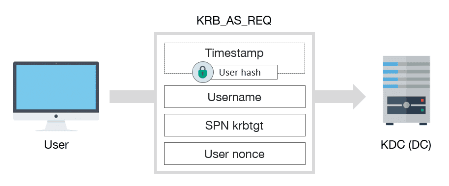
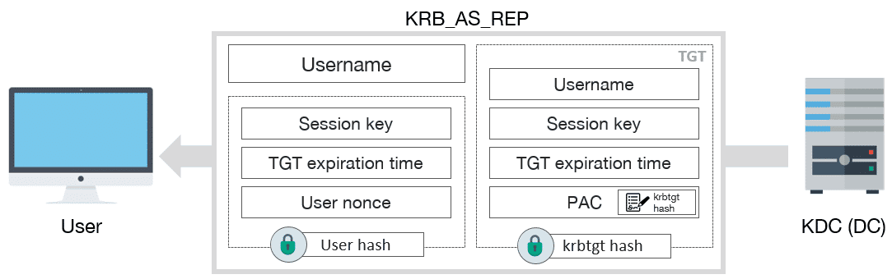
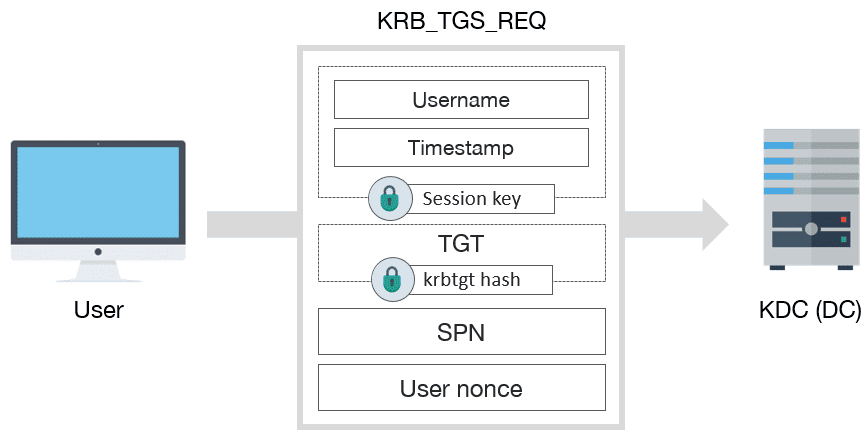
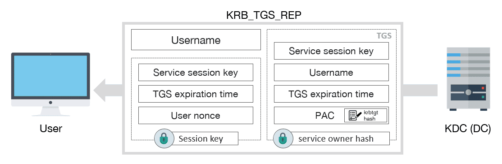
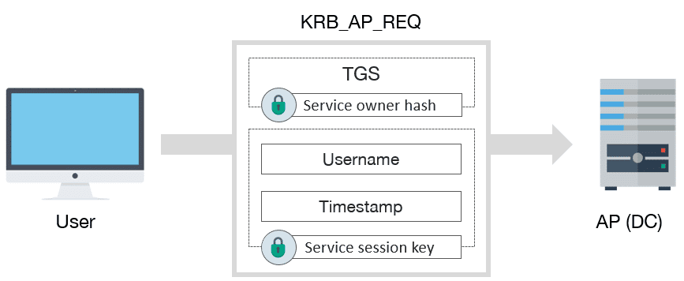
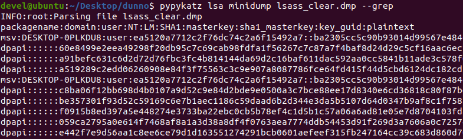
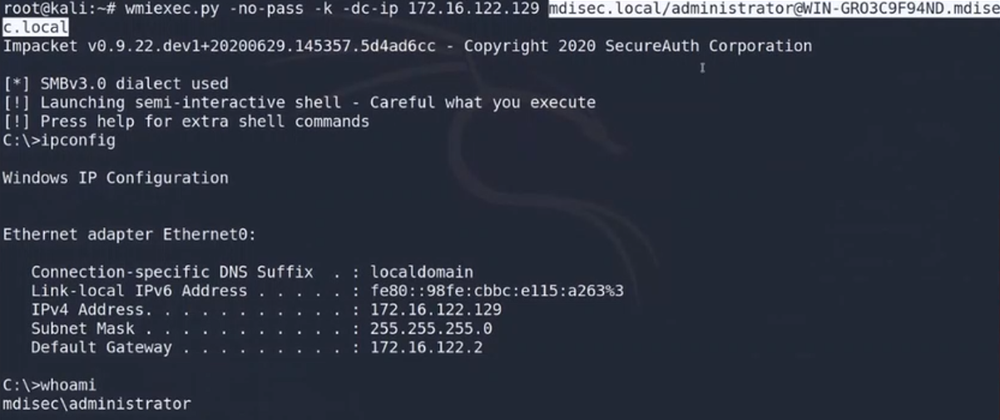

# **Network Hacker 0x06 - Kerberos Nedir Ne Değildir? /w Barkın Kılıç**  

Eğitim serisinin [6. videosunu](https://www.twitch.tv/videos/671842462) yazılı hale getirmeye çalışacağım. Keyifli okumalar dilerim.  

## **0x00: Giriş**

### **Kerberos Nedir? Nasıl Çalışır?**
Kerberos, Yunan mitolojisinde Hades'in yönettiği ölüler diyarının kapısında bekçilik yapan üç başlı bir köpeğin ismidir. Microsoft, Active Directory'deki kimlik doğrulama protokolüne bu ismi vermiş. Kerberos, hem TCP hem de UDP üzerinde çalışır ve her ikisinde de **88 numaralı portu** kullanır.

- **Authentication (Kimlik Doğrulama):** Kullanıcının oturum açma işlemi sırasında kimliğini doğrulaması.
- **Authorization (Yetkilendirme):** Kullanıcının bir servise erişim izni olup olmadığının kontrol edilmesi.

### **Temel Kavramlar**

- **User ve Client:** Servise erişmek isteyen kullanıcı veya istemci.
- **AP (Application Server):** Kullanıcının erişmek istediği hizmeti sunan uygulama sunucusu.
- **KDC (Key Distribution Center):** Kerberos'un biletleri yayınlamaktan sorumlu ana hizmeti. Domain Controller (DC) üzerinde çalışır.
  - **AS (Authentication Service):** TGT (Ticket Granting Ticket) bileti yayınlayan servistir.
  - **TGS (Ticket Granting Service):** Kullanıcının bir servise erişmek için kullandığı bilettir.

Kerberos, **bilet (ticket)** mekanizması ile çalışır. Kullanıcı, bir servise erişmek istediğinde önce kimliğini doğrular ve ardından bir bilet alır. Bu bilet ile servis sağlayıcısına erişim talep eder.

### **Kerberos Bileti Türleri**

- **TGT (Ticket Granting Ticket):** KDC (Key Distribution Center) tarafından verilen ve TGS'leri talep etmek için kullanılan bilettir.
- **TGS (Ticket Granting Service):** Kullanıcının bir servise erişmek için kullandığı bilettir.

### **Kerberos Mesaj Türleri**

- **KRB_AS_REQ:** TGT'yi KDC'den talep etmek için kullanılır.
- **KRB_AS_REP:** KDC tarafından TGT'nin iletilmesi için kullanılır.
- **KRB_TGS_REQ:** TGT kullanılarak TGS talep etmek için kullanılır.
- **KRB_TGS_REP:** KDC tarafından TGS'nin iletilmesi için kullanılır.
- **KRB_AP_REQ:** TGS kullanılarak bir servise erişim talep etmek için kullanılır.
- **KRB_AP_REP:** (İsteğe bağlı) Servis tarafından kullanıcıya kimlik doğrulama yanıtı göndermek için kullanılır.
- **KRB_ERROR:** Hata durumlarını iletmek için kullanılır.

## **0x01: Kerberos'un Çalışma Adımları**

### **1. Kullanıcı, KDC'den TGT talep eder**

Kullanıcı, kimlik bilgileri ile KDC'ye bir KRB_AS_REQ mesajı gönderir.
Zaman damgalı bir protokol olduğu için istemci ve KDC saatleri arasında en fazla 5 dakika fark olabilir.

### **2. KDC, Kullanıcıya TGT Döndürür**

KDC, kullanıcının bilgilerini kontrol eder ve kimliği doğrulanırsa bir **TGT** döndürür.
TGT, kullanıcıya belirli bir süre için geçerli olan bir yetki belgesi sağlar.

### **3. Kullanıcı, Servise Erişim İçin TGS Talep Eder**

Kullanıcı, TGT'yi kullanarak TGS talep eder.

### **4. KDC, Kullanıcıya TGS Döndürür**

KDC, servise erişim izni veren bir TGS bileti döndürür.

### **5. Kullanıcı, Servise KRB_AP_REQ Mesajı Gönderir**

Kullanıcı TGS'yi kullanarak servise erişim talebinde bulunur.
Yetkilendirme başarılı olursa servise erişim sağlanır.

## **0x02: Pratik Uygulama**

### **LSASS.exe ve Ticket Dump İşlemi**
Kerberos ticketları, Windows sistemlerde **LSASS.exe** (Local Security Authority Subsystem Service) süreci tarafından yönetilir. Bu süreç, kullanıcıların oturum bilgilerini, hashlerini ve ticketlarını saklar. Bir saldırgan, LSASS.exe'nin hafıza dump'ını alarak bu bilgilere erişebilir.

1. **LSASS Dump Alma:** LSASS.exe'nin hafıza dumpını almak için araçlar kullanılır 
2. **Dump'ı Analiz Etme:** Dump dosyasını analiz ederek kullanıcıların ticketlarını elde edebiliriz.
3. **Ticket Kullanma:** Elde edilen ticketlar, başka bir sistemde yetkili bir kullanıcı olarak oturum açmak için kullanılabilir.

>   Kerberos domain sorguları üzerinden gerçekleştiğinden eğer ip bazlı erişimler yaparsanız işin içine dnsi dahil etmediğinzden kerberos devere dışı kalır. Bunu ntlm üzerinden gerçekleştirmek istiyorsanız ip üzerinden yapabilirseniz makine adı servşs adı üzerinden gerçekleştirirseniz kerberos otomatikman dahil olur.  

### **Domain Admin Ticketını Kullanma**
Eğer bir sistemde Domain Admin kullanıcısının ticketını elde edersek bu ticketı kullanarak Domain Controller'a erişebilir ve istediğimiz işlemleri gerçekleştirebiliriz.

