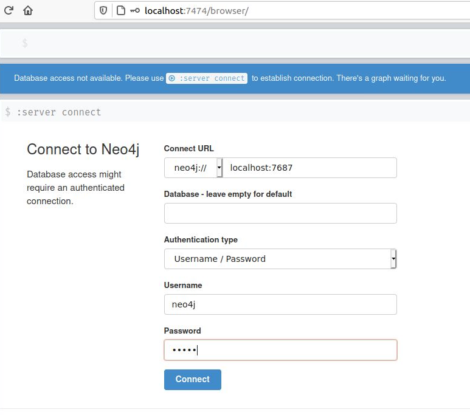
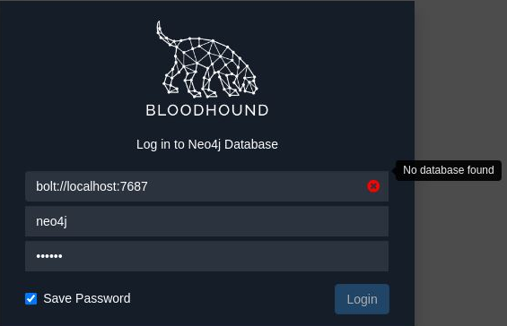
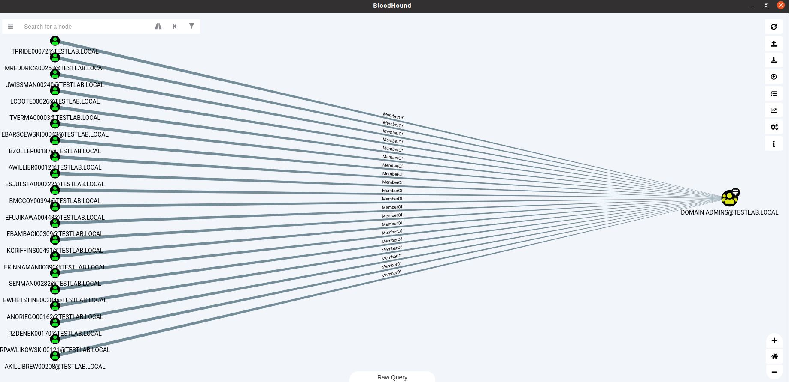

# **Network Hacker 0x07 - Kerberos ve AD Atakları /w Barkın Kılıç**  

Eğitim serisinin [7. videosunu](https://www.twitch.tv/videos/685522897) yazılı hale getirmeye çalışacağım. Keyifli okumalar dilerim.  

## **0x00: Giriş**

Kerberos protokolüne yönelik çeşitli saldırı türlerini ele alacağız. Bu saldırıları daha iyi anlamak adına Kerberos'un teorik temellerini anlatan önceki eğitimi okumanızı öneririm.  

## **0x01: Kerberos Brute-Force**

Kerberos, bir kimlik doğrulama protokolü olduğu için brute-force saldırılarına açıktır. Kerberos üzerinde brute-force saldırısı yapmanın avantajları:  

**Domain Hesabı Gerekmez:** Saldırıyı gerçekleştirmek için sadece KDC (Key Distribution Center) ile bağlantı yeterli.  
**Log Kayıtları:** Kerberos pre-authentication hataları, normal logon hatalarından (4625) farklı olarak özel log kayıtlarına (4771) düşer.  
**Kullanıcı Adı Doğrulama:** Kerberos, şifre yanlış olsa bile kullanıcı adının geçerli olup olmadığını belirtir. Bu, kullanıcı adlarını keşfetmek için büyük bir avantaj.  
**Pre-Authentication Olmayan Hesaplar:** Pre-authentication gerektirmeyen hesaplar keşfedilebilir ve bu hesaplar ASREPRoast saldırısı için kullanılabilir.  

Ancak, brute-force saldırıları kullanıcı hesaplarını kilitleyebilir bu nedenle dikkatli kullanılmalı.  

### **Linux'ta Kerberos Brute-Force**

Linux üzerinde Kerberos brute-force saldırısı gerçekleştirmek için **kerbrute.py** betiğini kullanacağız:  

```bash
root@kali:kerbrute# python kerbrute.py -domain jurassic.park -users users.txt -passwords passwords.txt -outputfile jurassic_passwords.txt
Impacket v0.9.18 - Copyright 2018 SecureAuth Corporation
[*] Valid user => triceratops
[*] Valid user => velociraptor [NOT PREAUTH]
[*] Valid user => trex
[*] Blocked/Disabled user => trex
[*] Stupendous => velociraptor:Sm4rtSp33d
[*] Saved TGT in velociraptor.ccache
[*] Saved discovered passwords in jurassic_passwords.txt
```

Belirtilen kullanıcı adları ve şifreler üzerinde brute-force saldırısı gerçekleştirir. Bulunan şifreler bir dosyaya kaydeder ve elde edilen TGT'ler (Ticket Granting Ticket) gelecekte kullanılmak üzere saklar.  

## **0x02: BloodHound**  

**BloodHound**, Active Directory (AD) ortamlarında saldırı yollarını keşfetmek için kullanılan bir araçtır. AD nesneleri (kullanıcılar, gruplar, bilgisayarlar) arasındaki ilişkileri analiz eder.  

### **BloodHound Kurulumu**  

BloodHound’u Kali Linux veya başka bir sistemde kurmak:  

#### **1. BloodHound'un İndirilmesi**  

```bash
git clone https://github.com/BloodHoundAD/BloodHound.git
cd BloodHound
```

#### **2. Neo4j Veritabanının İndirilmesi ve Çalıştırılması**  

BloodHound, AD ortamındaki veri ilişkilerini görselleştirmek için **Neo4j** grafik veritabanını kullanır. 

```bash
sudo apt install neo4j
```

Ardından Neo4j'i başlatın:  

```bash
sudo neo4j start
```

İlk çalıştırmada, tarayıcı üzerinden **http://localhost:7474** adresine gidip varsayılan giriş bilgilerini kullanarak oturum açabilirsiniz:  

- **Kullanıcı Adı:** neo4j  
- **Şifre:** neo4j  

  

Şifreyi değiştirdikten sonra BloodHound'un Neo4j ile bağlantısını sağlayabilirsiniz.  

### **BloodHound Kullanımı**  

BloodHound veritabanına bilgi eklemek için Active Directory’den veri toplayan **SharpHound** aracını kullanabilirsiniz. SharpHound, bir Windows ortamında çalıştırılarak gerekli bilgileri toplar ve BloodHound içine yüklenebilecek JSON dosyaları üretir.  

Windows makinede aşağıdaki komutu çalıştırarak veri toplayabilirsiniz:  

```powershell
SharpHound.exe -c all
```

JSON dosyalarını BloodHound arayüzüne yükleyerek analiz gerçekleştirebilirsiniz.  

### **BloodHound'da içe aktarılan sonuçların analizi**  

```bash
./BloodHound
```
Bu komutu ilk kez çalıştırdığınızda, kurulum sırasında seçtiğiniz Neo4j kimlik bilgilerinizi girmeniz gerekecek. “No database found” hatası alabilirsiniz.



Eğer böyle bir durum olursa neo4j'i yeniden başlatın:

```bash
sudo neo4j start
```

Daha sonra BloodHound'u tekrar açalım.

Verileri SharpHound veya başka bir araç kullanarak topladıktan sonra ortaya çıkan Zip dosyasını BloodHound arayüzüne sürükleyip bırakınca verileri yükleyecek ve Zip içindeki farklı JSON dosyalarını işleyecektir. İçe aktarma biraz zaman alabilir.

İçe aktarma işlemi hazır olduğunda arayüzümüze veriler gelecektir.


