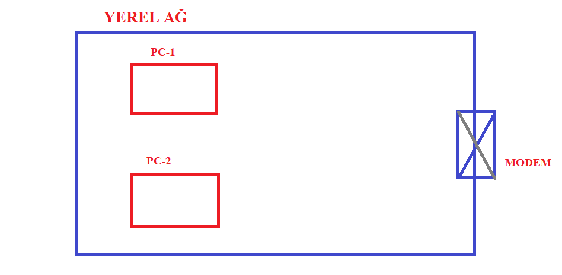
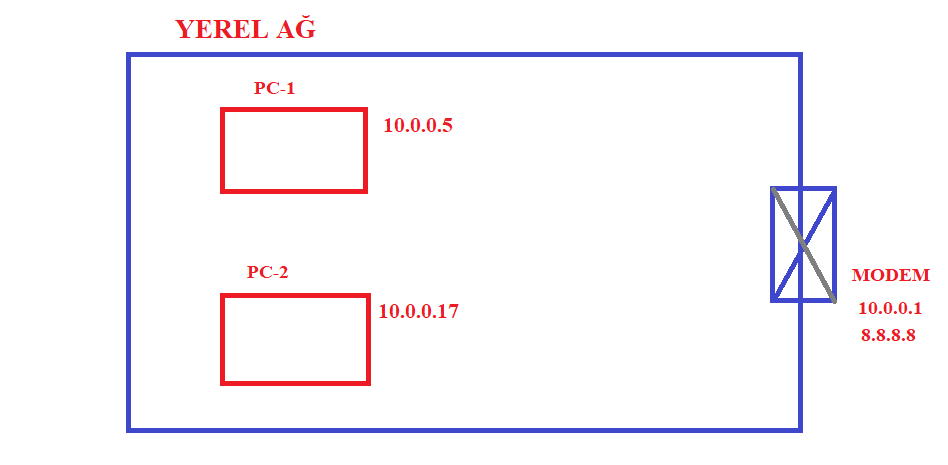
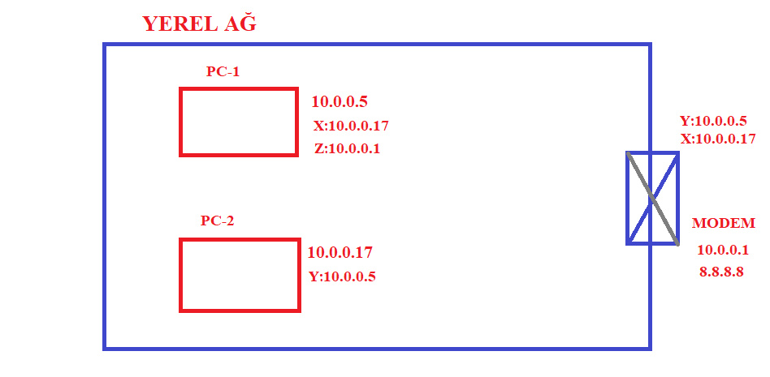
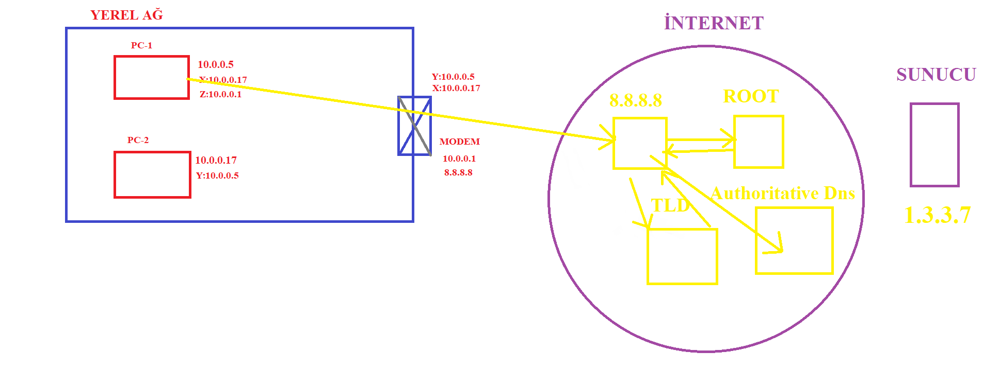
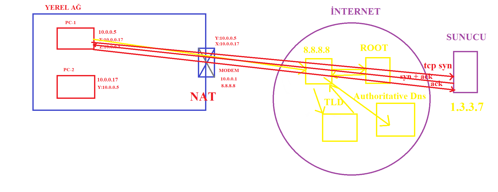
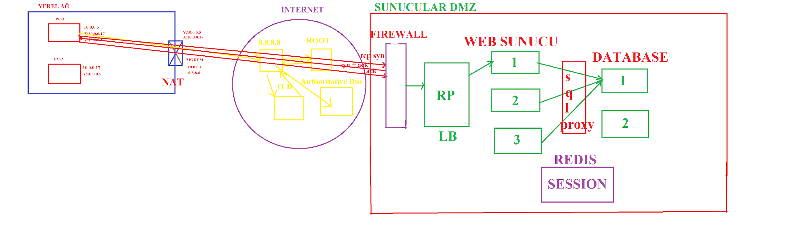
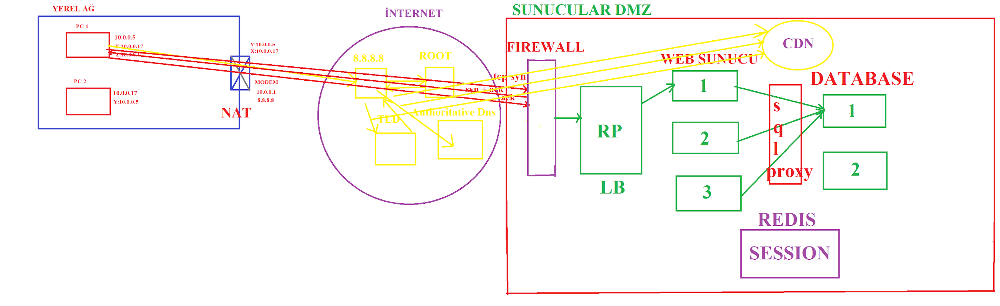
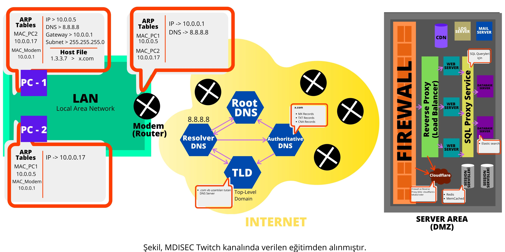

Belge `mfatih#0797` tarafından yazılmıştır.

# Web Security 101 - 0x04 | Bir Hacker'ın Gözünden Modern Web Nasıl Çalışır?

Şu bilgisayarı açınca ne oluyor? Hepiniz bilgisayarı açtığınızda internete bağlanmadan cmd.exe’nizi açıp ipconfig yazdığınızda bir ip görüyorsunuz. Buradan başlamak lazım temelde ne oluyor diye.

PC-1 bilgisayarını açtığın zaman bilgisayar üzerindeki işletim sistemi bulunduğu yerel ağda bir adet duyuru mesajı çıkıyor değil mi ve diyor ki abi ben ip adresi istiyorum demesi lazım yoksa bu modem gidip o adama IP adresini veremez değil mi temelde. Yani buradan hikaye başlayacak arkadaşlar hani cloud ve scability’e kadar gideceğim öyle söyleyeyim, başladığım yer sizi korkutmasın. O noktaya kadar gideceğim, gereksiz şeylere bakıyoruz diye düşünmeyin yani.

## ARP(Address Resolution Protocol)

Şimdi PC-1 bilgisayarı diyecek ki bana ip adresi istiyorum, modem de bakacak aha bunlar senin için uygun, al bunları kullan diyecek. Peki bu işi kim yapıyor? DHCP talebini kim karşılıyor? Modem. IP aralıklarını ben tahsis edeceğim. Modemin IP adresi 10.0.0.1 olsun, verdiği dns 8.8.8.8 olsun. PC-1 bilgisayarının 10.0.0.5, PC-2’nin de 10.0.0.17 aldığını düşünün. Peki, şöyle bir soru var günün sonunda değil mi, PC-1, PC-2 ile ya da modem ile konuşacağı zaman ip adresi ile iletişim kurmadan önce aslında layer-2 kullandığımız bir hikayenin olması gerekiyor. Nedir bu hikaye? ARP(Address Resolution Protocol)

PC-1, 10.0.0.17 ile konuşmak istediğinde 10.0.0.17’nin mac adresini alması lazım ve bu mac adresini öğrenmesi için de  bulunduğu ağ içerisinde bir duyuru mesajı yayınlayarak diyor ki eyyy 10.0.0.17! Ben seninle konuşmak istiyorum.

Gözünüzde şöyle canlansın, bir sınıf düşünün, ben de içindeyim ve 295 kişi var. İçinizden adı Ayşe olan biriyle konuşmak istediğimde Ayşe’yi bilmiyorum, hani öyle düşün, bende o bilgi yok, o yüzden kalkıyorum ayağa diyorum ki eyyyyy Ayşe! Gel beni bul, seninle konuşacağım. 295 kişiden adı Ayşe olan ayağa kalkıyor ve diyor ki ben Ayşe’yim, hadi konuşalım. Temelde bunun canlandığını düşünün. Şimdi arpın nasıl çalıştığını anladınız değil mi? Temelde bu kadarlık bir şey olduğunu düşün kafanda, iyice detaylara girmene gerek yok. Ulan şunu da öğrenmen lazım, Ayşe’yi gördüm artık tanıdım değil mi? Yani ben bir daha Ayşe’yle konuşmak istediğimde eyyy Ayşe beni bul dememe gerek yok diye düşünürsünüz. O nedenle abi 10.0.0.5, 10.0.0.17’nin mac adresini öğrendiğinde bu bilgiyi kendi üzerinde bir arp tablosu adı verilen bir yere yazar. Bu arp tablosunu işletim sisteminin yönettiğini düşünün. Bu kadar bilsen yeter.

PC-1’in üzerinde bir arp tablosu oluşuyor değil mi abi. Arp tablosuna bakarsan da şöyle bir bilgi görmeye başlayacaksın. Diyeceksin ki mac adresi X olsun, normalde mac adresini biliyorsunuz, hepiniz görmüşsünüzdür, X olduğunu düşünün ve burada şu yazacak X:10.0.0.17. PC-2’de zaten bu iletişim esnasında 10.0.0.5 ile konuştuğu için bu adamın da kendi üzerindeki arp tablosunda Y:10.0.0.5 bilgisini tutmaya başlayacak. Ulan bunlar konuşurken bu iletişimi gören modemin üzerinde de kendi arp tablosu oluşacağı için diyecek ki X makinesine sahip adam 10.0.017’de, Y makinesine sahip adam da 10.0.0.5’te . Modemin kendi mac’i var aslına bakarsanız. Yani şurda şey bilgisi de göreceksiniz(PC-1’in arp tablosunda) Z.10.0.0.1 . Yani her adam kendi arp tablosunu tutmaya başlıyor.

Evinizde temelde hikayenin böyle oluştuğunu bilseniz yeter. Modeminizin arayüzüne 192.168.1.1
yazdığınızda admin admin yazıp enter’a bastığınızda ağda bağlı olan cihazları gösterdiğinde, şu mac adresinde bu ip adresi var deyip bir liste çıkıyor hatta solda da iphone logosu, windows logosu, linux logosu görüyorsun ya o liste işte bunun (yukarıdaki resim) üzerindeki arp tablosundan geliyor. O logoları neye göre koyuyor dersen de mac adresinin ilk bölgesinin manufacturer kod olmasından alıyor database. Hikaye bu.

## X.COM'a giderken neler oluyor?

Bu bilgisayar x.com’a gidecek. Hikayemiz şu: ben x.com’a giderken neler oluyor? Biz şu anda işin yerel ağındayız, aklınızda olsun, sadece yerel ağındayız. Ben az önce ne yaptım? Ayağa kalktım, çok da güzel örnek oldu, ben ayağa kalktım eyy ayşe seninle konuşmak istiyorum beni bul dedim, kız geldi dedi ki ne oluyor. Bak çok güzel bir örnek oldu. Peki, sınıfta 295 kişiden biri gelse evet geldim dediği anda ben onun gerçekten Ayşe olup olmadığını öğrenemiyorum. Temeldeki sıkıntı özellikle arp tarafındaki hikayedeki en temel problem bu. Ben diyorum ki eyy Ayşe gel konuşalım, seninle konuşmak istiyorum, biri geliyor, o gerçekten Ayşe mi bilmiyorsun, böyle bir sıkıntı var işin içerisinde. Arp poisoning dediği hikayenin de en temel mevzusu buradan yaşanıyor. Arp spoofing, arp poisoning keywordlerinin temeldeki oluştuğu nokta buradan kaynaklanıyor. Arp poisoning dediği şey şöyle bir durum, arp protokolünde sadece şunu yapmak zorunda değilsin, sadece broadcast mesajlarına cevaplarından bir hikaye değil yani. Şunu da yapabilirim ben sınıfa girip, 295 kişinin arasına girip tüm son sesimle ben Kemal Atatürk’üm diye de bağırabilirim. Herkes de der ki evet sen Kemal Atatürk’sün. Protokoldeki sıkıntı buradan kaynaklanıyor zaten. Bu nedenle de yukarıdaki resme dönüp bakarsan buradaki PC-1 gidip eğer derse ki modeme  Arkadaşım, 10.0.0.17’nin mac’i X değil Y derse modemin 10.0.0.17 ile konuşmak istediği tüm trafik iptal olur, hepsi PC-1 makinesine gider. Yerel ağdaki man in the middle’ın temelde oluşmasındaki hikaye protokoldeki karşıdaki adamı tanımlayamamandan kaynaklanıyor. Aynı mac adresi iki farklı ip adresi için gözükmeye başlıyor. PC-2 x.com’a gitmek istediğinde bu trafiğin tamamını PC-1 görebilir.

Nasıl görebilir dersen şöyle bir hikaye yapacak;

PC-1 birinci poisoning ile modeme gidecek ve diyecek ki 10.0.0.17’nin mac adresi X değil Y olacak diyecek. Sonra gelip PC-2’yi de poison etmesi lazım. Niçin PC-2’yi poison edecek, onlardan konuşmadan önce öğrenmemiz gereken bir kısım daha var. Sen günün sonunda ne yapacaksın abi? Günün sonunda ne olacağını da anlatalım.

Şöyle bir hikaye olacak. x.com’un IP adresini bulacaksın. Bir tane sunucu olacak günün sonunda. Sen bu sunucuya içeriden trafikle çıkacaksın. Bu trafikle çıkmadan önce yerel ağda bazı eksik bilgiler var. PC-1’nin DHCP’den birkaç bilgi daha alması gerekiyor. 

1. Bu adam hangi dns ile konuşacak? Sen bilgisayarı açtığında dns’i kendin girmiyorsun ki biri onu otomatikman söylüyor. İşte onu söyleyen de DHCP. O yüzden 8.8.8.8 bilgisi PC-1’e gelir.
2. Bir diğer bilgi daha var, gateway. Yani 10.0.0.1. Gateway’in türkçesi geçiş kapısı. Ben bu yukarıdaki resimde gördüğünüz mavi alanın dışında bir yerle konuşmam için geçeceğim bir kapıya ihtiyacım var, geçiş kapısı. 

Dön sınıf örneğine, ben bağırdım eyyy Abdurrahman diye. Abdurrahman sınıfta yok. Abdurrahmanla konuşmak istiyorum. Ne yapacağım? sınıfın kapısından çıkmam lazım. İşte o kapı burda gördüğünüz gateway anlamına geliyor. Bir diğer konu da konuşmak istediğim adamın gerçekten benimle aynı ağda olup olmadığını anlamak. Burada bir bilgiye daha ihtiyacım var değerli dostlar. Nedir o bilgi? 255.255.255.0 diye yazdım. Yani hikaye ne olacak abi, günün sonunda bu PC-1 IP adresi 1.2.3.4 olan ve internette olan bir makineyle konuşmak istediğinde buradaki netmask’i kullanarak değerli dostum, ben bu ağın içinde miyim bunu anlayacak, bunu anlamak zorunda. Şimdi sen gözünle bakınca anlıyorsun. Senin ip 10.0.0.5, konuşmak istediğin ip 1.3.3.7. Bunlar aynı ağda mı? Sen hayır diyorsun ama bu bilgisayar için basit bir şey değil. Burada hepinize üniversitelerde computer science okuyan ve üniversite 2.sınıfta konusu olan bilgisayar ağları gibi derslerde sana bunu 8’er bitlik hallerde yazdırırlar. Konuşmak istediğin adresin bit karşılığını yazarsın. Bunları bire bir işleme sokarsın. Çıkan sonuca göre anlarsın ki bilgisayar böyle anlıyor olum işte anlatabildim mi. Subnet’in işi bu. Konuşmak istediğim adamla aynı ağda mıyım mı anlaman için önemli. Temel bilgisayar ağları bilgisini öğrendik mi? Daha bilgisayarı açtığında bunlar yaşanıyor. Sen daha google’a gitmeye başlamadın bile. Bak şimdi, bu bilgisayarı açtın güzelce ve bunlar yaşandı, gayet iyi. Peki, bundan sonraki  mevzuda hikayenin x.com olması lazım. Biz x.com’a gidiyoruz abi. Peki, ilk ne olacak? Browserı açtın, x.com yazdın, ne olmaya başlıyor? Buradan konuşmaya başlamamız arkadaşlar hikayeye.

Şimdi, temel bir bilgi öğretiyorum sizlere, isp’ye gideceğiz falan, ilk yapılan işlemlerden dns’e koşmadan önce bilgisayar kendi host dosyasına bakmalıdır. Linux'ta host dosyası neresidir? etc/hosts. Windows'ta da Allah bilir nerede, system32’nin altında bir yere koymuşlardır onu. Host dosyasında sen daha dns’e sormadan bir domainin isim çözümlendirmesinin ne olacağını söyleme imkanına sahIP adresin. Bilgisayar senin. Yani aslına bakarsan sen gidip kullandığın bilgisayarın host dosyasına gelip 1.3.3.7 deyip yanına da x.com yazarsan browser x.com’u çözmek istediğine dair talebi işletim sistemine ilettiğine işletim sistemi x.com’u gidip dns’e sorma işlemlerini hiç ürettirmeden aklınızda böyle otursun, bu x.com’un isim çözümlerdirmesini, dns çözümlendirmesini bu ip adresi döner. Gerçek ip adresi başka bişi olabilir. Yani sen browserını açtığında değerli dostum, x.com’a gideceğin zaman işletim sistemi önce hosts dosyasına bakar. Host dosyasında bulamadım ne olacak? DNS’e soracak. Bizim dnsimiz kim? 8.8.8.8 . Bana bunu kim söyledi? Bilgisayarı açtığımda işletim sistemi DHCP ile konuşmaya başlayıp bu bilgiyi çoktan aldı değil mi. Şimdi ben öncelikle dns ile konuşmalıyım.

DNS ile konuşmak için ben burdan bir yola çıkmalıyım. PC-1 8.8.8.8 dns serverı ile konuşuyor. İlk sorum hangi protokolle konuşulur layer açısından baktığımızda. Burada bir dns protokolü var, hangi portu kullanır? UDP  53. Yani PC-1’deki işletim sistemi 8.8.8.8’in 53 numaralı portuna udp bağlantı talebinde bulundu ve dedi ki x.com’un IP adresi ne?  8.8.8.8 dns sunucusunun adı resolver dns diye geçer. Resolver dns x.com’un ip sini bilmiyor ise gider başka bir abiye der ki eyyy root dns! ben x.com’un IP adresini öğrenmek istiyorum. Root dns de der ki eyyy 8.8.8.8 ben x.com’un IP adresini bilmiyorum ama sana bir cevap vereceğim. Sana bir adam söyleyeceğim. Bu adam x.com’un kim olduğunu biliyor, git ona sor der ve resolver dns bu adama gelir. Buna da TLD(Top-Level Domain) diyebiliriz. TLD’in işi *.comları bilmektir. Şimdi 8.8.8.8 buna gelip diyor ki abi x.com’u çöz bana ne olur, TLD de diyor ki kardeş ben x.com’u bilmiyorum ama x.comla ilgili kayıtları tutan adamı biliyorum, sen ona git. Böyle sırayla gezdiriyor bizi. Ben bu sefer authoritative dns’e gidiyorum, yetkili dns gibi düşünün. Bu adam işte x.com’un dns sunucusu. Sana bunun karşılığını öğretmek gerekirse terminali aç dig NS hurriyet.com.tr yaz. Hurriyet’in .com.tr ile ilgili tüm dns kayıtlarının bilindiği dns sunucusunu görebilirsin. Öğrenme yöntemin de bu aslında bakarsan. Yani sen arkada tarafta dönen bu yapıyı da  da bilmek zorundasın. x.com’un üzerinde dns kayıtları var işte. Buradaki önemli konulardan biri Authoritative DNS sunucunun x.com’dan başka bir domaini resolve etmeye çalışmaması lazım. Buradaki sunucuda tekrardan root’a gidip bu süreci yaşamamalı. Authoritative DNS’in tek işi x.com’la ilgili dns taleplerine cevap vermek. Hani dns sunucu konfigürasyonuna geliyor hikaye.

Öğrendiğimiz ip adresinin değerini 1.3.3.7 seçiyorum. x.com’un cevabı 1.3.3.7 olsun ip olarak. Daha x.com’la herhangi bir iletişim kurmadık. Şimdi burada ne gibi riskler var, hadi gelin bunları konuşmaya başlayalım. Zaten 8.8.8.8 dns sunucusu x.com’u öğrendikten sonra başka biri gelip yine x.com’u sorarsa bu süreç bir daha yaşanmaz. Direkt cevabını alır. Dns sunucunun  TTL(Time To Live)’lere göre cache’te tutulma süresi var. Ama sen bu adamın cache’ini poison edebilirsen 8.8.8.8’in verdiği cevapları yanıltırsan x.com’a gidecek http taleplerini kendi istediğin ip adresine çekebilecek hale geliyosun. Yani dns’in temeldeki oluşturduğu sıkıntılardan biri bu ya da sen gidip buradaki Authoritative DNS sunucusunu ele geçirebilirsen kurum sıçar. Mx kayıtlarını değiştirirsin, tüm e-postaları üstüne alırsın, cname kodları değiştirirsin, tüm kayıtları üstüne alırsın. txt kayıtlarını istediğini girebilirsin, gidip sertifika otoritelerinden sertifika issue ettirebilirsin. DNS internetin en zayıf halkası diye cümlelerin temelde oluşmasının hikayesi buradan kaynaklanıyor. Mx kaydı ne gibi detaylara maalesef giremiyorum da sen mail atarken mehmet@mehmet.com’a atıyorsun ya o mehmet.com’un çözümlenmesi lazım. O yüzden bu dns sunucuya mx sorgusu gelir. Sen hurriyete e posta atacağın zaman mx’i sorarsan ( dig MX hurriyet.com.tr) bu adamların e-posta sunucusu buymuş işte outlook. Tüm e-postaları microsoft 360’ tutuyorlarmış. DNS ile ilgili mevzuları anlattık. En büyük temeldeki sıkıntılardan bir tanesi de zaten TLD’lere yönelik olan siber saldırılardır. Adam dünyadaki tüm *.com'ların cevaplarını sahte dönebilir gibi sıkıntı hikayeler var yani burada. Türkiye’nin tarihinde yaşandı. Bir hacker ya da hacker grubu emin değilim Türkiye’deki nic tr’in sunucularına erişim sağladı. Türkiye’deki tüm com.tr’lere istediği gibi çözdürebiliyordu dns’leri istediği adrese. Anlaşıldı mı dns? Daha websitesine gitmedik.

Şimdi hikaye neye geliyor, ipyi öğrendin. Mevzu neye gelmeye başlayacak? Şimdi bir adet sunucumuz var, ip si 1.3.3.7. Bizim clientımız(PC-1) çıkacak, gatewayden geçecek, internetteki bütün routerlardan geçecek ve 1.3.3.7 (leet)’ye gelecek. Peki bu hangi protokol ile olacak, source ve destination ip’si ne olacak. Bu bağlantı 1.3.3.7’nin 80 portuna gitmeye çalışıyor. Peki bu hikaye yaşanırken tcp oluyor diyorsun ya buradaki source kime göre neye göre onlardan bahsetmeye çalışacağım.

Bir tcp header’ını en basit şekilde dörde böldüğümü düşünürsen destinaton ip 1.3.3.7, destionation port 80, source ip 10.0.0.5, source port’unda ise random bir değer olur, işletim sistemi bu değeri rastgele oluşturur. Bu bir tcp paketidir. Bu tcp paketi gateway’a geldikten sonra internette source portunda 10.0.0.5 yazarak gezemez. O yüzden burda da hayatınızda daha önce duyduğunuz NAT (Network address translation) diye bir işlem olmaya başlar. Bu neye tekabül ediyor biliyor musun? Buradaki router bu giden paketin source ipsini siliyor, öyle canlandır kafanda, kendisi bir ip adresi yazıyor 85.17.35.13 attım. Bu şu anlama geliyor , şu iki adamda (PC-1 ve PC-2) internette gezerken aynı ip adresine sahip. Bunu temelde yapmanız sebebi de internete bağlı olan cihaz sayısı ile ipv4 içerisindeki cihaz sayısı açısından baktığında hikaye bambaşka bi noktaya gidiyor yani. O yüzden de NAT’ı temelde bu kadar bilmen yeter. Evde DHCP’ni de bu NAT işlemini yapanı da modem olarak düşünebilirsin. İnternete bu paket çıktığında bu şekilde gidiyor ve her giden pakette şurdaki hikaye(ip source header kısmı) değişkenlik göstermektedir.

Giden bir tcp bağlantımız var değil mi? 1.3.3.7 ipli sunucuya giden tcp paketinin tipi nedir? Tcp syn paketidir. Sunucu bize ne dönecek? syn - ack. Bu paketi alan pc tekrardan bir paket gönderecek. tcp ack. Bu sürecin adı nedir? tcp 3-way handshake (3’lü el sıkışma)(syn, syn-ack,ack). Peki bu niye var? Buna ne gerek vardı? Kim kimdir bilelim diye. Ben 85.17.35.13 ipli bilgisayardan source ip adresini gidip 5.5.5.5 yazıp bir tcp datasını basıp gönderirsem , server kendisiyle konuşan kişiyi 5.5.5.5 sanır. Ama üçlü el sıkışmayı koyarsan önüne işte o zaman bunun üzerine biraz düşün, işte o zaman buradaki ip spoofing hikayesine bir engel oluşturmuş oluyorsun. Bu üçlü el sıkışma şu demek, ben Ayşe’ye diyorum ki Ayşe seninle konuşmak istiyorum(tcp syn), Ayşe bana diyor ki senin benimle konuşmak istediğini duydum ve konuşmak için müsaitim(tcp syn-ack), ben de diyorum ki ben seninle konuşmak istediğimi söylemiştim, sen de bana benimle konuşmak için müsait olduğunu söylemiştin, ben bu süreç için çok mutluyum, hadi konuşalım paketini (tck ack) gönderiyor ve bundan sonra sen konuşmaya başlayabiliyorsun. Hikaye böyle canlansın kafanızda. Şimdi bunların hiçbiri olmadan http’ye gelemezsin, mümkün değil.

Yani bak şunu öğrendin, alt katmandaki arp protokolünde bir sistem bozulursa üstteki udp ve tcp de sıçıyor. Burda 3’lü el sıkışmayı tamamladım. Gayet güzel tamamlandı her şey. Şimdi işte http’ye çıkabilirsin. HTTP’ nin açılımı nedir? Hypertext Transfer Protocol. Dünyanın en boktan protokollerinden bir tanesi olarak addediyorum ben çünkü http request var, bu requesti alıyor sunucu ve buna bir response veriyor. Bu kadar. Bir sonraki request response’ a dair bir değer, yapı vs içerisinde yok, http’yi başka bir yayında gömmüştüm ben herhalde dimi? Yakından takip eden dostlar bilebilir. Gömmüştüm büyük ihtimalle, hatırlamıyorum. Şimdi bak kafanda şu canlansın, bir adet http requesti gönderiyorsun, buna da bir tane response alıyorsun ya o senin üst katmanında, 7. katmanında bir request bir response iki tane paketin varken aşağıda 150 tane tcp paketi gidip geliyor. Anladın mı mevzuyu? Request ve response http tarafında yaşanırken aşağıda 150 tane tcp paketi gidip geliyor temelde. Bunu nasıl anlarsın? Onu da ben göstermeyim, aç wireshark’ı , bir tane web sitesine http get talebi at, bak tcp paketlerine, anasının nikahı kadar paket geçecek. Yukarıdaki adımların tamamını wiresharkta görebilirsin. Bunu da uygulamak senin görevin. DHCP requestini göreceksin, ARP requestini göreceksin, DNS requestini göreceksin, üçlü el sıkışmaları göreceksin ve peşinden http göreceksin, bu senin görevin dostum. Ödev isteyenlere söylemiş olayım.

## Firewall

Şimdi başka bir hikayeye dalmaya başlayacağız. Sen bunu şey diye düşünüyosun 1.3.3.7 bir sunucudur. Mysql de üstünde, apache de üstünde, php de üstünde, statik dosyalar da üstünde, ip tablesı da üstünde, mail attığı send maili de üstünde. Abi bu eşek mi lan, günümüzde böyle olabilir mi sizce yani. Böyle olamaz, bir kere zaten hepinizin duyduğu bir kelime var.  Ne o kelimenin adı? firewall. Kurumun bir firewall’ı var. Öncelikle aslında sen 80 portuyla konuşurken günümüzde aslında üzerinden geçtiğin bir firewall var. Bu firewall ne işe yarar? Ateş duvarı. Siber saldırı engelleyici kalkan sistemler. Siktir lan. Çok basit bir konu. Network management toolu benim gözümde. Bu next generation firewallar çıktı tabiki de. Ulan şu source tan gelen bu source nun bu portuyla konuşabilir, konuşamaz işini yapıyor. Öteki yandan da  başka bir katma değerli kısmı daha var, onu da konuşacağız birazdan. 

Şimdi senin ilk geçtiğin yer firewall. Firewall’ı geçtikten sonra sen konuştuğun buradaki web sunucuya geliyorsun. Kafanda şöyle canlansın. Burası kurumun sunucular bölgesi ya da kafanda DMZ gibi canlanabilir. Firewall ve gerisinin böyle olduğunu düşün.

Firewallun artılarından bir tanesini söyleyim. Bu sunucuya, hepiniz şeyi duymuşsunuzdur tcp syn attack, tcp syn requestini yolluyorsun, ip adresine random bir ip yazıyorsun, paketi de tcp syn paketi olarak yolluyorsun, bu adam web sunucuya kadar geliyor, web sunucu başka bir adamla konuşmaya çalışıyor. Çünkü niye? Sourcea random bir ip adresi yazdın, syn float. Bu durumda bu sunucunun kaynağı tükeniyor. Bu sunucu fakir gibi kaynağın tükendiğinden mütevellit ön taraftaki firewallar hayvan gibi bir güce sahip olur genellikle ve üçlü el sıkışmayı sen bu firewall tarafıyla yaşarsın. Bu firewall ddosu engelliyor hikayesinin temeldeki mantığı böyle düşün işte. Şimdi bu firewall üzerinde bilmem kaç gigabyte ram var, şu fakir web sunucu 1 gb digital ocean gibi düşün. Bi de abi ihtiyacın 1 gbllik ki. Ulan bir gün ddos yerim diye niye üzerinde 64 gb memory tutasın, yazık. Bu firewallun temelde yaptığı hikaye bu olmaya başlıyor. Şimdi geldin mi web sunucusuna.

Bu web sunucusu üzerinde de başka hikayeler dönmeye başlıyor. Bu web sunucusunun üzerinde ne var? Bunun üzerine teknolojileri yığ babam yığ: apache/nginx , php/fqm, mysql, static dosyalar. Böyle bir şey olmaz diye konuştuk günümüzde. Zaten şöyle de bi konumuz var işin içerisinde , dünyada ne kadar domain var? Kaç tane ip adresi var? Bu ikisini bir kıyasla. Domainler yürüyor gidiyor, her gün yeni TLD’ler çıkıyor. O nedenle, senin yerel ağda yaşadığın NAT’a çağrışan bir hikaye yapar web sunucuları. Bunun da adına biz virtual hosting vhost diyebiliriz. Bu da şu anlama geliyor eğer http requestini daha önce hayatınızda görmüşsünüzdür diye düşünüyorum. Http get requestinin host alanına yazdığın hackerconf.stream bilgisi burdaki apache-nginx websunucusuna geldiğinde burdaki adamın konfigürasyonu içinden şöyle bir tanım vardır: host alanında hackerconf.stream yazıyorsa bu adamın çağırdığı dosyayı sen al /var/www/hackerconf.stream içindeki dosyayı ver. Dünyada birden fazla domain 15,20 tane domainin ip adresi aynı olurken bir sunucu üzerinde farklı uygulamalar olarak bu şekilde çalışabiliyor. Biz de buna virtual hosting adını veriyoruz. Günümüzde şöyle bir sorun var; bir eticaret sitesi olduğunu düşünün, bu e ticaret sitesinin şu tür sıkıntıları var, blackfriday gelince çok fazla satış yapmaya başladığından sunucu kendisine yetmiyor, yetmediği zaman bu adam ne yapacak? Bu tür durumların çözümünde eskiden (scability dediğimiz konulara gelmeye başlıyoruz) ram eklerdin, disk eklerdin, sunucuyu taşırdın başka bir yere falan filan. Ama günümüzde bu konuyu böyle yapmaktansa ben gideyim web sunucusundan 3 tane kurayım, codebase mi de hepsine ekleyim ve kaynak kodumu üçüne de yükleyeyim dedim. Daha sonra dedin ki bir database(1) kurayım, bir tane daha kurayım(2). 1,2 ve 3 numaralı sunucular database1 ile konuşsun. Yani database’i sunucudan ayırdın. Dışarıya bir yere koydun.

Öte yandan, firewall’dan gelen requestleri sunuculara göndermen lazım. Sana bir şey daha lazım. Bunun da adı reverse proxy. ya da load balancer olarak geçmeye başlıyor. Yani senin http requestin bu reverse proxy sistemine geliyor ve bu requesti içerde müsait olan sunucuya aktarmaktadır. Peki bu sunucu neye göre aktarıyo dersen aslında şöyle bir hikaye olmaya başlamakta, şöyle sorunlar da yaşanmaya başlıyor işin içerisinde. Request, reverse proxy sisteminden web sunucusuna(1 numaralı) geldikten sonra bu uygulamanın çalışırken oluşturduğu session eğer diskte tutuluyorsa bu sefer tüm requestlerin aynı sunucuya gitmesi gerek çünkü bu session bu sunucunun diskinde (2. ve 3. sunucunun diskinde session yok). Sıkıntı temelde buradaki session modellerini de konuşacağız. Bu reverse proxy neye göre çalışacak ? Bir numaralı sunucu çökerse 2 numaralı sunucuya gönderirsem logout olur. Bu tür hikayeler oluşmaya başlıyor. Peki, hepiniz gördüğü şu popüler cloudfare’in cookie’si ne işe yarıyor dersen, reverse proxy  senden gelen requesti hangi sunucuya set ettiğini bir cookie vererek ölçüyor. Bu cookie sunucuya hiçbir zaman geçmez, bizimle reverse proxy arasındadır. Bu cookie’yi kendi üzerinde tutarak diyor ki ulan ben bu adam daha önce bu tarihte gelmişti, şu bilgiler vardı, ben bunu bir numaralı sunucuya göndermiştim, tekrardan bire yollayım diyor. O cookie’nin de temelde oluşmasının hikayesi bu,. Reverse proxy cookie bazlı yapabilir mevzuyu.

Başka sorunlar çıkmaya başladı. 1 numaralı database düşerse ne olacak? 1 ve 2 numaralı databaseler aktif pasif mi çalışmaya başlayacak? Bu sefer birden fazla database sunucusuna ihtiyaç duymaya başlayacaksın, tek birinin yetmediği durumlar var hayatta. Üç tane database’in var diyelim, tek bir tanesinin yetmediği durumda bu sefer senin arada (database ile web sunucu arasında) sql query için proxy sunucusuna ihtiyacın var, proxy servisine. Tüm sql sorgularını bu sql servisine soruyorsun. O senin için hangi database uygunsa ona soruyor. Günümüzde bu mikro servis yapısı dediğiniz hikayelerin çıkmaya başladığı nokta burası olmaya başlıyor. Database’deki verilere erişim sağlayıp cevap veren tek bir tane servis var, ihtiyacı olan onunla konuşuyor, sürekli herkes query yapmasın mevzuya. Big Data ile bir alakası yok hikayenin. Session’ı ne yapacaksın peki? Bu session nasıl yaşayacak senin hayatında, nerden ilerleyecek? Session’ı sen yıllarca diskte tuttun. Diskin problemini anlattım sana. Ondan sonra gittin bunu database’e yazdın. Niye database’e yazıyorsun? Adam sunucu1’ e de gitse sunucu2’ ye de gitse farketmez çünkü session database’de. Cookie’ sinden giderim, session’ ına erişirim. Ama bu sefer database’deki querylerin artmaya başlıyor. Querylerin arttığı için sorun olmaya başlıyor. Session database’e her write işlemi sıkıntı, performans problemin var. O write işleminin sonunda bir ioi’ya dönüşecek ve diske yazılacak. Bu tür sorunlarla karşılaşmaya başlayacaksın. Session da gelip geçici bir şey, beyhude. O nedenle, madem böyle beyhude bir husus var, session’a bir şey yazıyoruz, adam logout olunca da siliyoruz. O nedenle, biz bunu gidelim başka bir şeyin içinde tutalım demeye başladılar ve session servisleri ortaya çıkmaya başladı, redis gibi. Yani request gelse reverse proxy’den geçip web sunucuya geldi, kullanıcı adı ve parolayı sordu, sen database’e sql proxy’den geçtin, uygun database buymuş, buna sordun, bu sana kullanıcı adı parolayı validate etti, sen sunucu1 de session oluşturdun ve session servise yazdın. Bundan sonra sürekli session servise gidiyorsun. Key value memory’de tutulan bir şey, acayip hızlı, diske dokunmuyor gibi hikayeler dönüyor. Tüm bunları anlattıysak hikayede şey olmaya başlayacak, her şeyin backup’ını düşüneceksin. Bu redis düşerse ne olacak(session service)? Bu redis düştüğü an itibariyle bu redis ayağa kalkana kadar hiçkimse login olamaz, session oluşmuyor. Redisi de backup’lamak zorundasın.

Bir diğer konu, bir web uygulaması düşün, sisteme dosya yüklüyosun, sunucu2’de kalıyor sadece dosya. Olmaz ki, ben yarın logout olduğumda sunucu3’e düştüğümde de dosyaya erişebilmem lazım. O nedenle de senin hayatında statik dosyaları tutup yöneteceğin bir CDN gündeme gelmeye başlıyor. Bu sefer bir dosya sistemi yüklendiğinde 1 numaralı uygulama sunucusu shell upload var ya, o shell upload günümüzde modern  sistemlerde çok yok. Çünkü o dosya uygulama sunucusunun diskine dokunmadan CDN(Content delivery network) content sunumu yapan sunuculara gönderiliyor ve bunun burdaki dosya adı database’e kaydedilmekte gibi düşün ve bir numaralı web uygulaması bir html içerik üretip link vereceği zaman zaten web application database’de bu değeri alıp o linki kullanıcıya verdiğinde o resmi çağırmak isteyen browser firewall’dan geçip CDN’e gidiyor.

 Tüm bunların haricinde başka neler var günümüz uygulamalarında? Full text searchleri veri tabanında yapmanın maliyetlerinden mütevellit ortaya çıkan elastic search konuları. Buraya gelen tüm http requestleri ve hepsinin logging’nin tutulduğu sunucular ve ayrıca sunucular bölgesinin aynısından bir tane daha var ama bunun adı DRC. Olurda DMZ’in çalıştığı datacenter patlarsa tüm trafik dns’ler üzerinden hiçbir kesinde yaşamadan DRC üzerinden aynı hizmeti vermeye devam edebilsin. 

|Yayında anlatılan temsili ağın diyagramı|
|:--:| 
|  | 
| *Görsel* `davidhayter#3371` tarafından yapılmıştır. |
